# Centralize Error Hierarchy

## Problem Statement

Custom error classes are scattered across 13+ files throughout the codebase, with no central documentation or ontology. This creates several problems:

- **Name collisions:** Two `ChannelNotFoundError` classes exist in different modules
- **No visibility:** Developers don't know what errors exist or when to create new ones
- **Inconsistent patterns:** Some errors have codes, some don't; inheritance is inconsistent
- **Hard to maintain:** Error changes require hunting through the codebase
- **No documentation:** No central place to understand the error hierarchy

Centralizing errors in `src/errors/` will provide a clear ontology, prevent duplicates, and improve maintainability.

## Current Error Locations

### Error Files Found

1. **src/storage/errors.ts** (4 classes)
   - `StorageError` (base)
   - `ItemNotFoundError`
   - `ConflictError`
   - `ValidationError`

2. **src/storage/memory-tool/errors.ts** (7 classes)
   - `MemoryToolError` (base)
   - `PathNotFoundError`
   - `PathAlreadyExistsError`
   - `InvalidPathError`
   - `TextNotFoundError`
   - `ContentTooLargeError`
   - `TextNotUniqueError`
   - `InvalidLineNumberError`

3. **src/integrations/discord/errors.ts** (5 classes)
   - `DiscordIntegrationError` (base)
   - `InvalidTokenError`
   - `PermissionError`
   - `ChannelNotFoundError` ⚠️ COLLISION
   - `RateLimitError`

4. **src/integrations/discord/presence/errors.ts** (2 classes)
   - `PresenceError` (extends DiscordIntegrationError)
   - `StatusGenerationError`

5. **src/integrations/discord/channel-registry/errors.ts** (4 classes)
   - `ChannelRegistryError` (base)
   - `ChannelNotFoundError` ⚠️ COLLISION
   - `AmbiguousChannelError`
   - `WellKnownChannelNotFoundError`

6. **src/integrations/discord/message-history/fetcher.ts** (2 classes)
   - `ChannelNotAccessibleError` (extends DiscordIntegrationError)
   - `MessageFetchError`

7. **src/integrations/discord/message-history/snowflake.ts** (1 class)
   - `InvalidSnowflakeError` (extends DiscordIntegrationError)

8. **src/integrations/discord/state/transitions.ts** (1 class)
   - `TransitionError` (extends Error)

9. **src/storage/dynamo-retry.ts** (1 class)
   - `DynamoTimeoutError` (extends Error)

10. **src/utils/path-validator.ts** (1 class)
    - `PathSecurityError` (extends Error)

11. **scripts/mark-well-known-channels.ts** (may have errors, not in src/)

12. **tools/stryker-risk.ts** (may have errors, not in src/)

13. **tools/test-redundancy.ts** (may have errors, not in src/)

### Total Error Classes: 28 custom errors

### Name Collision Detail

**`ChannelNotFoundError` appears in TWO places:**

1. **src/integrations/discord/errors.ts:**
   ```typescript
   export class ChannelNotFoundError extends DiscordIntegrationError {
       constructor(public readonly channelId: string) {
           super(`Discord channel not found: ${channelId}`, 'CHANNEL_NOT_FOUND');
           this.name = 'ChannelNotFoundError';
       }
   }
   ```

2. **src/integrations/discord/channel-registry/errors.ts:**
   ```typescript
   export class ChannelNotFoundError extends ChannelRegistryError {
       constructor(public readonly channelName: string) {
           super(`Channel not found: ${channelName}`, 'CHANNEL_NOT_FOUND');
           this.name = 'ChannelNotFoundError';
       }
   }
   ```

**Key difference:** One takes `channelId` (string ID), the other takes `channelName` (human-readable name). They serve different purposes but have the same name, which is confusing.

## Proposed Structure

Create a centralized `src/errors/` directory with organized error modules:

```
src/errors/
├── README.md           # Ontology documentation and guidelines
├── index.ts            # Re-exports all errors
├── base.ts             # IsambardError base class
├── storage.ts          # All storage-related errors
├── discord.ts          # All Discord integration errors
├── agent.ts            # Agent-related errors
├── config.ts           # Configuration errors
└── utils.ts            # Utility errors (path validation, etc.)
```

### Module Organization

**src/errors/base.ts:**
```typescript
/**
 * Base error class for all Isambard errors.
 * Provides consistent error handling and stack trace support.
 */
export class IsambardError extends Error {
    constructor(
        message: string,
        public readonly code: string,
        public readonly context?: Record<string, unknown>
    ) {
        super(message);
        this.name = 'IsambardError';

        // Maintain proper stack trace for where our error was thrown (V8 only)
        if (Error.captureStackTrace) {
            Error.captureStackTrace(this, this.constructor);
        }
    }
}
```

**src/errors/storage.ts:**
```typescript
import { IsambardError } from './base';

/**
 * Base error for all storage-related operations
 */
export class StorageError extends IsambardError {
    constructor(message: string, code: string, context?: Record<string, unknown>) {
        super(message, code, context);
        this.name = 'StorageError';
    }
}

/**
 * Storage: DynamoDB-specific errors
 */
export class DynamoTimeoutError extends StorageError {
    constructor(operation: string, timeoutMs: number) {
        super(
            `DynamoDB operation timed out: ${operation}`,
            'DYNAMO_TIMEOUT',
            { operation, timeoutMs }
        );
        this.name = 'DynamoTimeoutError';
    }
}

/**
 * Storage: Generic item operations
 */
export class ItemNotFoundError extends StorageError {
    constructor(public readonly itemId: string) {
        super(`Item not found: ${itemId}`, 'ITEM_NOT_FOUND', { itemId });
        this.name = 'ItemNotFoundError';
    }
}

export class ConflictError extends StorageError {
    constructor(
        public readonly itemId: string,
        public readonly expectedVersion: number,
        public readonly actualVersion: number
    ) {
        super(
            `Version conflict for item ${itemId}: expected ${expectedVersion}, got ${actualVersion}`,
            'CONFLICT',
            { itemId, expectedVersion, actualVersion }
        );
        this.name = 'ConflictError';
    }
}

export class ValidationError extends StorageError {
    constructor(public readonly issues: unknown[]) {
        super(`Validation failed: ${JSON.stringify(issues)}`, 'VALIDATION_ERROR', { issues });
        this.name = 'ValidationError';
    }
}

/**
 * Storage: Memory tool errors
 */
export class MemoryToolError extends StorageError {
    constructor(message: string, code: string, context?: Record<string, unknown>) {
        super(message, code, context);
        this.name = 'MemoryToolError';
    }
}

export class PathNotFoundError extends MemoryToolError {
    constructor(public readonly path: string) {
        super(`Memory not found at path: ${path}`, 'PATH_NOT_FOUND', { path });
        this.name = 'PathNotFoundError';
    }
}

export class PathAlreadyExistsError extends MemoryToolError {
    constructor(public readonly path: string) {
        super(`Memory already exists at path: ${path}`, 'PATH_ALREADY_EXISTS', { path });
        this.name = 'PathAlreadyExistsError';
    }
}

export class InvalidPathError extends MemoryToolError {
    constructor(public readonly path: string, public readonly reason: string) {
        super(`Invalid memory path "${path}": ${reason}`, 'INVALID_PATH', { path, reason });
        this.name = 'InvalidPathError';
    }
}

export class TextNotFoundError extends MemoryToolError {
    constructor(public readonly path: string, public readonly text: string) {
        super(`Text "${text}" not found in memory at ${path}`, 'TEXT_NOT_FOUND', { path, text });
        this.name = 'TextNotFoundError';
    }
}

export class ContentTooLargeError extends MemoryToolError {
    constructor(
        public readonly path: string,
        public readonly size: number,
        public readonly maxSize = 350_000
    ) {
        super(
            `Memory content at ${path} is too large: ${size} bytes (max: ${maxSize} bytes)`,
            'CONTENT_TOO_LARGE',
            { path, size, maxSize }
        );
        this.name = 'ContentTooLargeError';
    }
}

export class TextNotUniqueError extends MemoryToolError {
    constructor(public readonly path: string, public readonly text: string, public readonly count: number) {
        super(
            `Text "${text}" appears ${count} times in memory at ${path}, expected exactly once`,
            'TEXT_NOT_UNIQUE',
            { path, text, count }
        );
        this.name = 'TextNotUniqueError';
    }
}

export class InvalidLineNumberError extends MemoryToolError {
    constructor(public readonly path: string, public readonly lineNumber: number, public readonly totalLines: number) {
        super(
            `Invalid line number ${lineNumber} in memory at ${path} (total lines: ${totalLines})`,
            'INVALID_LINE_NUMBER',
            { path, lineNumber, totalLines }
        );
        this.name = 'InvalidLineNumberError';
    }
}
```

**src/errors/discord.ts:**
```typescript
import { IsambardError } from './base';

/**
 * Base error for all Discord integration operations
 */
export class DiscordError extends IsambardError {
    constructor(message: string, code: string, context?: Record<string, unknown>) {
        super(message, code, context);
        this.name = 'DiscordError';
    }
}

/**
 * Discord: Authentication and permissions
 */
export class InvalidTokenError extends DiscordError {
    constructor() {
        super('Discord bot token is invalid or expired', 'INVALID_TOKEN');
        this.name = 'InvalidTokenError';
    }
}

export class PermissionError extends DiscordError {
    constructor(public readonly action: string) {
        super(`Bot lacks permission to ${action}`, 'PERMISSION_DENIED', { action });
        this.name = 'PermissionError';
    }
}

/**
 * Discord: Channel operations
 */
export class ChannelNotFoundByIdError extends DiscordError {
    constructor(public readonly channelId: string) {
        super(`Discord channel not found by ID: ${channelId}`, 'CHANNEL_NOT_FOUND_BY_ID', { channelId });
        this.name = 'ChannelNotFoundByIdError';
    }
}

export class ChannelNotFoundByNameError extends DiscordError {
    constructor(public readonly channelName: string) {
        super(`Discord channel not found by name: ${channelName}`, 'CHANNEL_NOT_FOUND_BY_NAME', { channelName });
        this.name = 'ChannelNotFoundByNameError';
    }
}

export class ChannelNotAccessibleError extends DiscordError {
    constructor(public readonly channelId: string, public readonly reason?: string) {
        super(
            `Channel ${channelId} is not accessible: ${reason ?? 'unknown reason'}`,
            'CHANNEL_NOT_ACCESSIBLE',
            { channelId, reason }
        );
        this.name = 'ChannelNotAccessibleError';
    }
}

export class AmbiguousChannelError extends DiscordError {
    constructor(public readonly channelName: string, public readonly matchCount: number) {
        super(
            `Ambiguous channel name '${channelName}': found ${matchCount} matches`,
            'AMBIGUOUS_CHANNEL',
            { channelName, matchCount }
        );
        this.name = 'AmbiguousChannelError';
    }
}

export class WellKnownChannelNotFoundError extends DiscordError {
    constructor(public readonly channelType: string) {
        super(
            `Required well-known channel not found: ${channelType}`,
            'WELL_KNOWN_CHANNEL_NOT_FOUND',
            { channelType }
        );
        this.name = 'WellKnownChannelNotFoundError';
    }
}

/**
 * Discord: Message operations
 */
export class MessageFetchError extends DiscordError {
    constructor(public readonly channelId: string, cause?: unknown) {
        super(`Failed to fetch messages from channel ${channelId}`, 'MESSAGE_FETCH_ERROR', { channelId, cause });
        this.name = 'MessageFetchError';
    }
}

export class InvalidSnowflakeError extends DiscordError {
    constructor(public readonly value: string) {
        super(`Invalid Discord snowflake: ${value}`, 'INVALID_SNOWFLAKE', { value });
        this.name = 'InvalidSnowflakeError';
    }
}

/**
 * Discord: Rate limiting
 */
export class RateLimitError extends DiscordError {
    constructor(public readonly retryAfter: number) {
        super(
            `Discord rate limit exceeded. Retry after ${retryAfter}ms`,
            'RATE_LIMIT_EXCEEDED',
            { retryAfter }
        );
        this.name = 'RateLimitError';
    }
}

/**
 * Discord: Presence management
 */
export class PresenceError extends DiscordError {
    constructor(message: string, code = 'PRESENCE_ERROR', context?: Record<string, unknown>) {
        super(message, code, context);
        this.name = 'PresenceError';
    }
}

export class StatusGenerationError extends PresenceError {
    constructor(message: string, cause?: unknown) {
        super(message, 'STATUS_GENERATION_ERROR', { cause });
        this.name = 'StatusGenerationError';
    }
}

/**
 * Discord: State transitions
 */
export class TransitionError extends DiscordError {
    constructor(message: string, context?: Record<string, unknown>) {
        super(message, 'TRANSITION_ERROR', context);
        this.name = 'TransitionError';
    }
}
```

**src/errors/agent.ts:**
```typescript
import { IsambardError } from './base';

/**
 * Base error for agent-related operations
 */
export class AgentError extends IsambardError {
    constructor(message: string, code: string, context?: Record<string, unknown>) {
        super(message, code, context);
        this.name = 'AgentError';
    }
}

// Future agent errors can be added here:
// - SessionError
// - ToolExecutionError
// - PromptBuildingError
// - etc.
```

**src/errors/config.ts:**
```typescript
import { IsambardError } from './base';

/**
 * Base error for configuration-related issues
 */
export class ConfigError extends IsambardError {
    constructor(message: string, code: string, context?: Record<string, unknown>) {
        super(message, code, context);
        this.name = 'ConfigError';
    }
}

// Future config errors can be added here:
// - MissingConfigError
// - InvalidConfigError
// - etc.
```

**src/errors/utils.ts:**
```typescript
import { IsambardError } from './base';

/**
 * Utility errors for path validation, etc.
 */
export class PathSecurityError extends IsambardError {
    constructor(public readonly path: string, public readonly reason: string) {
        super(`Path security violation: ${path} - ${reason}`, 'PATH_SECURITY_ERROR', { path, reason });
        this.name = 'PathSecurityError';
    }
}
```

**src/errors/index.ts:**
```typescript
// Re-export all errors for convenient importing
export * from './base';
export * from './storage';
export * from './discord';
export * from './agent';
export * from './config';
export * from './utils';
```

## README.md Content: Error Ontology Documentation

**src/errors/README.md:**

```markdown
# Isambard Error Hierarchy

This directory contains all custom error classes used throughout Isambard. Centralizing errors provides a clear ontology, prevents name collisions, and improves maintainability.

## Error Hierarchy

```mermaid
graph TD
    Error[Error - JavaScript base]
    IsambardError[IsambardError - Isambard base]

    StorageError[StorageError]
    DiscordError[DiscordError]
    AgentError[AgentError]
    ConfigError[ConfigError]

    Error --> IsambardError
    IsambardError --> StorageError
    IsambardError --> DiscordError
    IsambardError --> AgentError
    IsambardError --> ConfigError

    StorageError --> ItemNotFoundError
    StorageError --> ConflictError
    StorageError --> ValidationError
    StorageError --> DynamoTimeoutError
    StorageError --> MemoryToolError

    MemoryToolError --> PathNotFoundError
    MemoryToolError --> PathAlreadyExistsError
    MemoryToolError --> InvalidPathError
    MemoryToolError --> TextNotFoundError
    MemoryToolError --> ContentTooLargeError
    MemoryToolError --> TextNotUniqueError
    MemoryToolError --> InvalidLineNumberError

    DiscordError --> InvalidTokenError
    DiscordError --> PermissionError
    DiscordError --> ChannelNotFoundByIdError
    DiscordError --> ChannelNotFoundByNameError
    DiscordError --> ChannelNotAccessibleError
    DiscordError --> AmbiguousChannelError
    DiscordError --> WellKnownChannelNotFoundError
    DiscordError --> MessageFetchError
    DiscordError --> InvalidSnowflakeError
    DiscordError --> RateLimitError
    DiscordError --> PresenceError
    DiscordError --> TransitionError

    PresenceError --> StatusGenerationError
```



## When to Create a New Error

Before creating a new error class, ask:

1. **Does an existing error fit?**
   - Use `ItemNotFoundError` for missing items (generic)
   - Use `ValidationError` for validation failures
   - Use `PathNotFoundError` for memory-specific not-found errors

2. **Is this error domain-specific?**
   - Discord errors → `src/errors/discord.ts`
   - Storage errors → `src/errors/storage.ts`
   - Agent errors → `src/errors/agent.ts`

3. **Does it extend the right base?**
   - Discord errors extend `DiscordError`
   - Storage errors extend `StorageError`
   - All Isambard errors ultimately extend `IsambardError`

## When to Reuse Existing Errors

**Reuse errors for generic concepts:**
- `ItemNotFoundError` - Any item/entity not found
- `ConflictError` - Optimistic locking conflicts
- `ValidationError` - Schema or data validation failures

**Create specialized errors for domain-specific issues:**
- `PathNotFoundError` - Memory tool specific (carries path context)
- `ChannelNotFoundByIdError` - Discord specific (carries channelId)
- `InvalidSnowflakeError` - Discord specific (snowflake validation)

## Naming Conventions

### Error Class Names
- Use descriptive, specific names
- End with `Error` suffix
- Use past tense for actions: `ItemNotFoundError`, not `ItemNotFoundErr` or `ItemNotFound`

### Error Codes
- Use `SCREAMING_SNAKE_CASE`
- Be specific: `CHANNEL_NOT_FOUND_BY_ID`, not `NOT_FOUND`
- Group related codes with prefixes: `DYNAMO_TIMEOUT`, `DISCORD_RATE_LIMIT`

### Error Messages
- Be descriptive and actionable
- Include relevant context (IDs, paths, reasons)
- Use consistent phrasing across similar errors

## How to Add Error Codes (Optional Enhancement)

Currently, error codes are stored as strings. For better type safety and IDE autocomplete, consider creating an enum:

```typescript
// src/errors/codes.ts
export enum ErrorCode {
    // Storage errors
    ITEM_NOT_FOUND = 'ITEM_NOT_FOUND',
    CONFLICT = 'CONFLICT',
    VALIDATION_ERROR = 'VALIDATION_ERROR',

    // Discord errors
    CHANNEL_NOT_FOUND_BY_ID = 'CHANNEL_NOT_FOUND_BY_ID',
    CHANNEL_NOT_FOUND_BY_NAME = 'CHANNEL_NOT_FOUND_BY_NAME',
    RATE_LIMIT_EXCEEDED = 'RATE_LIMIT_EXCEEDED',

    // ... etc
}
```

Then use the enum in error constructors:

```typescript
export class ItemNotFoundError extends StorageError {
    constructor(public readonly itemId: string) {
        super(`Item not found: ${itemId}`, ErrorCode.ITEM_NOT_FOUND, { itemId });
        this.name = 'ItemNotFoundError';
    }
}
```

## Error Context

All Isambard errors support a `context` field for additional metadata:

```typescript
throw new MemoryToolError(
    'Failed to update memory',
    'UPDATE_FAILED',
    { path: '/identity/name', reason: 'locked', attemptCount: 3 }
);
```

Use context for:
- Debugging information (IDs, paths, timestamps)
- Retry metadata (attempt counts, delays)
- Related entities (user IDs, channel IDs)
- Causes of nested errors

## Migration Notes

### Name Collision Resolution

**Old:**
- `src/integrations/discord/errors.ts::ChannelNotFoundError` (by ID)
- `src/integrations/discord/channel-registry/errors.ts::ChannelNotFoundError` (by name)

**New:**
- `ChannelNotFoundByIdError` - Channel lookup by ID failed
- `ChannelNotFoundByNameError` - Channel lookup by name failed

### Import Updates

**Before:**
```typescript
import { ChannelNotFoundError } from '../errors';
```

**After:**
```typescript
import { ChannelNotFoundByIdError } from '@/errors';
```

Or use specific imports:
```typescript
import { ChannelNotFoundByIdError } from '@/errors/discord';
```
```

## Name Collision Resolution

**Problem:** Two `ChannelNotFoundError` classes exist with different purposes.

**Resolution:**

1. **`ChannelNotFoundError` (by ID)** → rename to **`ChannelNotFoundByIdError`**
   - Used when looking up a channel by Discord snowflake ID
   - Takes `channelId: string` parameter
   - Error code: `CHANNEL_NOT_FOUND_BY_ID`

2. **`ChannelNotFoundError` (by name)** → rename to **`ChannelNotFoundByNameError`**
   - Used when looking up a channel by human-readable name
   - Takes `channelName: string` parameter
   - Error code: `CHANNEL_NOT_FOUND_BY_NAME`

**Update all imports and catch blocks:**
```typescript
// Before
try {
    const channel = await getChannelById(id);
} catch (error) {
    if (error instanceof ChannelNotFoundError) {  // Ambiguous!
        // ...
    }
}

// After
try {
    const channel = await getChannelById(id);
} catch (error) {
    if (error instanceof ChannelNotFoundByIdError) {  // Clear!
        // ...
    }
}
```

## Migration Strategy

### Phase 1: Create Error Directory Structure
1. Create `src/errors/` directory
2. Create `base.ts` with `IsambardError`
3. Create module files (`storage.ts`, `discord.ts`, etc.)
4. Create `index.ts` for re-exports
5. Create `README.md` with ontology documentation

### Phase 2: Move and Consolidate Errors
1. Copy all error classes to appropriate modules
2. Rename `ChannelNotFoundError` classes to resolve collision
3. Ensure all errors extend the correct base class
4. Add error codes to all errors consistently

### Phase 3: Update Imports
1. Find all imports of old error files
2. Update to import from `@/errors` or `@/errors/<module>`
3. Update catch blocks with renamed errors
4. Verify no broken imports

### Phase 4: Update Tests
1. Update test imports
2. Update error assertions
3. Verify all tests pass

### Phase 5: Remove Old Error Files
1. Delete old error files from original locations
2. Verify no remaining references
3. Run full test suite
4. Run mutation tests to verify 100% score

### Phase 6: Documentation
1. Update project documentation with new error locations
2. Update CLAUDE.md with error guidelines
3. Add examples of proper error usage

## Testing Strategy

### Unit Tests
- Test each error class individually
- Verify error messages, codes, and context
- Verify inheritance chain

```typescript
describe('ChannelNotFoundByIdError', () => {
    it('should have correct properties', () => {
        const error = new ChannelNotFoundByIdError('123456789');

        expect(error).toBeInstanceOf(ChannelNotFoundByIdError);
        expect(error).toBeInstanceOf(DiscordError);
        expect(error).toBeInstanceOf(IsambardError);
        expect(error).toBeInstanceOf(Error);

        expect(error.name).toBe('ChannelNotFoundByIdError');
        expect(error.code).toBe('CHANNEL_NOT_FOUND_BY_ID');
        expect(error.channelId).toBe('123456789');
        expect(error.message).toContain('123456789');
    });
});
```

### Integration Tests
- Verify errors are thrown correctly in real scenarios
- Verify error handling in catch blocks
- Verify error serialization (for logging)

### Mutation Tests
- Ensure error construction logic is tested
- Verify error message formatting
- Verify error code assignment

## Benefits

### Centralized Ontology
- Single source of truth for all errors
- Easy to browse and understand error hierarchy
- Clear documentation of when to use each error

### Prevent Duplicates
- Name collisions caught at import time
- Clear naming conventions prevent confusion
- Easy to search for existing errors

### Consistent Patterns
- All errors have codes
- All errors extend appropriate base class
- All errors support context metadata
- All errors have proper stack traces

### Better Developer Experience
- IDE autocomplete for error imports
- Go-to-definition works from any import
- Easy to find all usages of an error
- Centralized documentation

### Improved Maintainability
- Single place to update error patterns
- Easy to add new error domains
- Clear inheritance hierarchy
- Consistent error handling

## Priority

**High.** The name collision issue (`ChannelNotFoundError`) is actively causing confusion. Centralizing errors will prevent future issues and improve code maintainability. This refactor should be done before adding new error types to prevent further sprawl.
