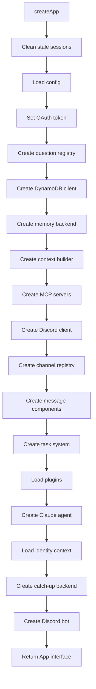
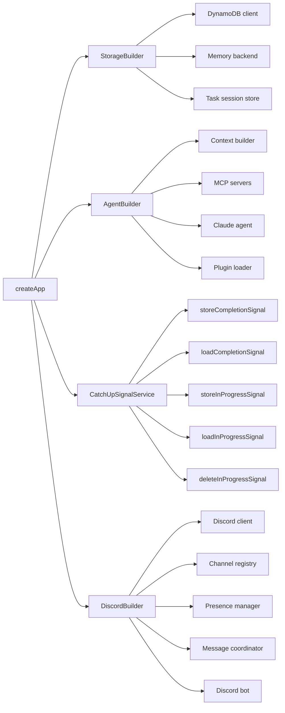
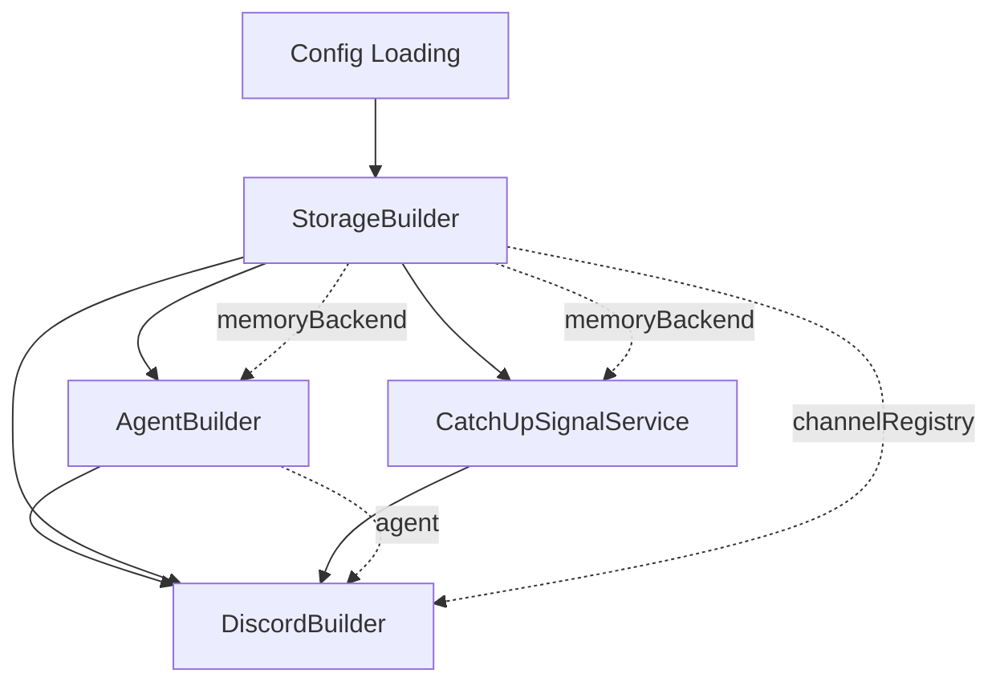

# Refactor createApp() God Object

## Problem Statement

The `createApp()` function in `src/index.ts` is a 464-line God Object that violates Single Responsibility Principle:
- 30+ imports from across the codebase
- Creates 15+ components with complex dependencies
- Mixes configuration loading, component initialization, and lifecycle management
- Difficult to test individual initialization paths
- Hard to reason about dependency ordering

**Current Size:** 464 lines
**Complexity:** High coupling, sequential initialization, error handling scattered throughout

## Current Architecture

The current `createApp()` function performs sequential initialization:



## Proposed Architecture

Extract four builder classes and a service, leaving `createApp()` as a thin orchestrator:



### Component Responsibilities

**StorageBuilder** (15 lines)
- Creates DynamoDB client
- Initializes memory backend
- Sets up task session store
- Returns: `{ docClient, tableName, memoryBackend, taskSessionBackend }`

**AgentBuilder** (25 lines)
- Creates context builder from memory backend
- Sets up MCP servers (memory, Discord, inbox)
- Loads plugins
- Creates Claude agent with all dependencies
- Returns: `{ contextBuilder, agent, memoryMcpServer, discordMcpServer, inboxMcpServer }`

**CatchUpSignalService** (50 lines)
- Encapsulates catch-up signal storage/retrieval business logic
- Takes memory backend as dependency
- Provides clean interface for bot to store/load signals
- Returns: object with 5 methods (store/load completion, store/load/delete inProgress)

**DiscordBuilder** (50 lines)
- Creates Discord client and channel registry
- Sets up message components (fetcher, summarizer, search)
- Creates inbox manager
- Initializes bot state manager
- Creates Discord bot with all dependencies
- Returns: `{ bot, channelRegistry, inboxManager }`

**createApp()** (~30 lines)
```typescript
export async function createApp(): Promise<App> {
    await cleanupAllStaleSessions();
    const config = loadConfig(Resource as any);
    process.env.CLAUDE_CODE_OAUTH_TOKEN = config.agent.oauthToken;

    const questionRegistry = createQuestionRegistry();

    // Storage layer
    const storage = createStorage(Resource as any);

    // Agent layer (depends on storage)
    const agent = createAgent({
        storage,
        questionRegistry,
    });

    // Catch-up signal service
    const catchUpSignals = createCatchUpSignalService(storage.memoryBackend);

    // Discord layer (depends on storage + agent)
    const discord = createDiscordBot({
        config: config.discord,
        perchConfig: config.perch,
        storage,
        agent,
        catchUpSignals,
        questionRegistry,
    });

    return {
        start: discord.bot.start,
        stop: discord.bot.stop,
    };
}
```

## Dependency Flow



**Key Dependencies:**
- `AgentBuilder` needs `memoryBackend` from `StorageBuilder`
- `CatchUpSignalService` needs `memoryBackend` from `StorageBuilder`
- `DiscordBuilder` needs `agent` from `AgentBuilder` and `memoryBackend` from `StorageBuilder`

## Step-by-Step Implementation

### Step 1: Extract StorageBuilder

**Why first:** Fewest dependencies, purely technical initialization

**Files:**
- Create `src/app/storage-builder.ts`
- Export `createStorage(dynamoDBConfig)` function

**Test strategy:**
- Unit test storage builder in isolation
- Mock DynamoDB client
- Verify all components created with correct dependencies

**Risk mitigation:**
- Keep existing `createApp()` code intact
- Add new builder alongside, verify equivalence
- Replace in `createApp()` only after tests pass

### Step 2: Extract AgentBuilder

**Why second:** Depends only on storage (Step 1 output)

**Files:**
- Create `src/app/agent-builder.ts`
- Export `createAgent({ storage, questionRegistry })` function

**Test strategy:**
- Unit test agent builder with mocked storage
- Verify MCP servers wired correctly
- Test plugin loading errors

**Dependencies:**
- Takes `memoryBackend` from StorageBuilder
- Takes `questionRegistry` from createApp

### Step 3: Extract CatchUpSignalService

**Why third:** Independent business logic, depends only on storage

**Files:**
- Create `src/app/catchup-signal-service.ts`
- Export `createCatchUpSignalService(memoryBackend)` function

**Test strategy:**
- Unit test service with mocked memory backend
- Test error handling for missing signals
- Verify JSON serialization/deserialization

**Benefits:**
- Removes 70 lines of inline signal logic from createApp
- Clear separation of concerns
- Easier to test signal persistence independently

### Step 4: Extract DiscordBuilder

**Why fourth:** Depends on all previous steps

**Files:**
- Create `src/app/discord-builder.ts`
- Export `createDiscordBot(options)` function

**Test strategy:**
- Integration test with real Discord client (mocked login)
- Verify all handlers registered correctly
- Test bot lifecycle (start/stop)

**Dependencies:**
- Takes `agent` from AgentBuilder
- Takes `memoryBackend` and `channelRegistry` from StorageBuilder
- Takes `catchUpSignals` from CatchUpSignalService

### Step 5: Simplify createApp()

**Why last:** Only safe after all builders proven equivalent

**Changes:**
- Replace sequential initialization with builder calls
- Remove try/catch blocks (builders handle internally)
- Simplify to ~30 lines

**Test strategy:**
- Full integration test of createApp
- Verify app.start() and app.stop() work end-to-end
- Test hot reload compatibility

## Testing Strategy

**Unit Tests:**
- Each builder testable in isolation with mocked dependencies
- StorageBuilder: Mock DynamoDB operations
- AgentBuilder: Mock storage backend
- CatchUpSignalService: Mock memory backend operations
- DiscordBuilder: Mock Discord client and dependencies

**Integration Tests:**
- createApp() with real dependencies (local DynamoDB)
- Verify component wiring end-to-end
- Test error propagation from builders

**Regression Prevention:**
- Keep existing createApp tests passing during refactor
- Add new tests for each builder
- Only remove old code after equivalence proven

## Risks and Mitigation

**Risk 1: Initialization order bugs**
- Mitigation: Extract builders one at a time, verify equivalence at each step
- Keep existing code until new code proven equivalent

**Risk 2: Hot reload compatibility**
- Mitigation: Test hot reload after each extraction
- Ensure global state handling preserved

**Risk 3: Error handling changes**
- Mitigation: Builders throw same errors as original code
- Preserve error messages for debugging

**Risk 4: Breaking existing tests**
- Mitigation: Run full test suite after each step
- Fix tests incrementally, never break CI

## Benefits

**Testability:**
- Each builder independently testable
- Mock dependencies easily
- Faster test execution (no full app initialization)

**Maintainability:**
- Single Responsibility Principle enforced
- Clear dependency flow
- Easier to understand initialization order

**Extensibility:**
- Add new storage backends without touching agent code
- Swap agent implementations without changing Discord setup
- Add new components by creating new builders

**Code Quality:**
- Reduced cyclomatic complexity
- Clearer separation of concerns
- Better error handling boundaries
