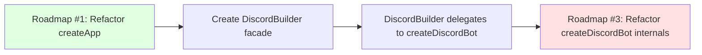

# Refactor Discord Bot Internals

## Problem Statement

The `createDiscordBot()` function in `src/integrations/discord/bot.ts` is 1477 lines with complex initialization logic:

**Current issues:**
- Single massive function handling too many concerns
- 10+ component creations with complex dependencies
- Event handler registration mixed with component setup
- Difficult to test individual setup logic
- Hard to understand initialization order
- Tight coupling between Discord-specific and generic logic

**Important context:** This roadmap depends on completing **Roadmap #1 (Refactor createApp God Object)** first:
- Roadmap #1 creates `DiscordBuilder` facade in `src/app/discord-builder.ts`
- That facade delegates to `createDiscordBot()` internally
- **This roadmap** then breaks up what's inside `createDiscordBot()`
- Separation prevents context exhaustion for AI agents (two focused refactors vs. one massive refactor)

## Current Structure

The `createDiscordBot()` function currently handles:

1. **Client management** (lines 1046-1067): Hot reload protection, global client reuse
2. **Coordinator creation** (line 1070): Message coordinator initialization
3. **Rate limiter creation** (line 1071): Discord API rate limiting
4. **Question/answer system** (lines 1072-1076): Question registry and answer classifier
5. **State management** (lines 1082-1086): Bot state manager initialization
6. **Event handler setup** (lines 1088-1107): Error handler, rate limit logging
7. **Ready handler** (lines 1114-1373): Massive async handler containing:
   - Recent message tracking (lines 1121-1129)
   - Rate limiter creation (lines 1132-1135)
   - Answer classifier creation (lines 1138-1140)
   - Interaction handler registration (lines 1143-1153)
   - Dynamic status generator creation (lines 1157-1159)
   - Presence manager creation (lines 1163-1189)
   - Presence manager start (line 1190)
   - BotStateManager subscriptions (lines 1206-1274)
   - DMTracker and ResponseRouter creation (lines 1284-1287)
   - Catch-up session runner setup (lines 1290-1302)
   - Perch session runner setup (lines 1305-1318)
   - Channel registry initialization (line 1322)
   - Message coordinator integration (lines 1325-1338)
   - Message handler registration (lines 1341-1359)
   - Inbox and catch-up initialization (lines 1362-1372)
8. **Lifecycle methods** (lines 1375-1438): start(), stop(), cleanup logic

## Dependency on Roadmap #1



**Sequencing rationale:**
1. First: Extract high-level builders in `createApp()` to establish clean boundaries
2. Then: Break up complex internal logic inside those builders
3. Prevents: Single massive refactor that exhausts AI agent context

**What Roadmap #1 creates:**
```typescript
// src/app/discord-builder.ts (created by Roadmap #1)
export function createDiscordBot(options: BuilderOptions) {
    // High-level orchestration
    const storage = options.storage;
    const agent = options.agent;

    // Delegate to bot.ts (which Roadmap #3 will refactor)
    return createDiscordBotInternal({
        config: options.config,
        onMessage: /* ... */,
        agent,
        channelRegistry: storage.channelRegistry,
        // ... other options
    });
}
```

## Proposed Extractions

### 1. PresenceSetup

**Responsibility:** Create and wire presence management system

**Components:**
- Presence manager (active/idle status generators)
- Dynamic status generator (LLM-powered)
- BotStateManager subscriptions for presence updates

**Interface:**
```typescript
export function setupPresence(options: PresenceSetupOptions): PresenceSetup {
    // Create active status generator
    // Create idle status generator
    // Create dynamic status generator (if identityContext provided)
    // Create presence manager
    // Start presence manager
    // Subscribe to BotStateManager events
    return {
        presenceManager,
        dynamicStatusGenerator,
        unsubscribe: () => { /* cleanup */ }
    };
}
```

**Files:**
- Create `src/integrations/discord/setup/presence-setup.ts`
- Extract lines 1157-1274 from bot.ts

**Benefits:**
- Isolates presence logic from bot lifecycle
- Testable in isolation (mock client and state manager)
- Clear subscription management (unsubscribe function)

### 2. CoordinatorSetup

**Responsibility:** Create message coordinator and wire to agent

**Components:**
- Message coordinator creation
- Processor function (calls agent.handleInput)
- Response routing (onResponse callback)
- Presence updates during processing
- Catch-up/perch resume logic

**Interface:**
```typescript
export function setupCoordinator(options: CoordinatorSetupOptions): MessageCoordinator {
    // Create message coordinator
    // Set processor to call agent.handleInput
    // Handle attachments (fetch images, save files)
    // Wire onResponse to sendResponse
    // Handle catch-up/perch resume
    return coordinator;
}
```

**Files:**
- Create `src/integrations/discord/setup/coordinator-setup.ts`
- Extract lines 505-670 from bot.ts (setupCoordinatorIntegration function)

**Benefits:**
- Coordinator configuration in one place
- Clear separation of concerns
- Easier to test message processing logic

### 3. CatchUpSetup

**Responsibility:** Create and configure catch-up session runner

**Components:**
- Catch-up session runner creation
- Agent session integration (runAgentSession callback)
- Signal storage/loading (completion and inProgress)
- Presence updates during catch-up
- Response routing for catch-up results

**Interface:**
```typescript
export function setupCatchUp(options: CatchUpSetupOptions): CatchUpSessionRunner | undefined {
    // Check if all dependencies available
    // Create catch-up session runner
    // Wire to agent.handleInput with specialMode: 'catchup'
    // Handle interruption and resume
    // Route responses to well-known channel
    return catchUpSessionRunner;
}
```

**Files:**
- Create `src/integrations/discord/setup/catchup-setup.ts`
- Extract lines 700-786 from bot.ts (setupCatchUpSessionRunner function)

**Benefits:**
- Catch-up logic in one place
- Clear dependencies (inbox, agent, memory backend)
- Testable with mocked dependencies

### 4. PerchSetup

**Responsibility:** Create perch scheduler and session runner

**Components:**
- Perch session runner creation
- Perch scheduler creation
- Agent session integration (runAgentSession callback)
- Scheduler triggers and deferral logic
- Presence updates during perch

**Interface:**
```typescript
export function setupPerch(options: PerchSetupOptions): PerchSetup | undefined {
    // Check if config provided and enabled
    // Create perch session runner
    // Create perch scheduler
    // Wire to agent.handleInput with specialMode: 'perching'
    // Start scheduler
    return {
        runner: perchSessionRunner,
        scheduler: perchScheduler
    };
}
```

**Files:**
- Create `src/integrations/discord/setup/perch-setup.ts`
- Extract lines 808-900 from bot.ts (setupPerchSessionRunnerAndScheduler function)

**Benefits:**
- Perch logic isolated from bot lifecycle
- Clear configuration (enabled flag, schedule)
- Easy to test scheduler triggers

### 5. EventHandlerSetup

**Responsibility:** Register Discord event handlers

**Components:**
- Error handler registration
- Rate limit logging
- Ready handler orchestration
- Message handler registration
- Interaction handler registration

**Interface:**
```typescript
export function setupEventHandlers(options: EventHandlerSetupOptions): void {
    // Register error handler
    // Register rate limit logging
    // Register clientReady handler (orchestrates all other setup)
    // Register messageCreate handler
    // Register interactionCreate handler
}
```

**Files:**
- Create `src/integrations/discord/setup/event-handler-setup.ts`
- Extract lines 1088-1373 from bot.ts

**Benefits:**
- All event registration in one place
- Clear separation from component creation
- Easier to test handler behavior

## Proposed Architecture

After extractions, `createDiscordBot()` becomes a thin orchestrator:

```typescript
export function createDiscordBot(options: DiscordBotOptions): DiscordBot {
    // 1. Client management (hot reload protection)
    const client = getOrCreateClient(options.config, options.client);

    // 2. Create required components
    const questionRegistry = options.questionRegistry ?? createQuestionRegistry();
    const botStateManager = options.botStateManager ?? createBotStateManager({
        logger,
        updateThrottleMs: options.config.presence?.updateThrottleMs,
    });

    // 3. Register error handler (must be before clientReady)
    client.on('error', createErrorHandler());

    // 4. Register clientReady handler (deferred setup)
    client.once('clientReady', async (readyClient: Client) => {
        createReadyHandler()(readyClient);

        // Create rate limiter
        const rateLimiter = createDiscordRateLimiter({ globalConcurrency: 5, logger });

        // Setup presence (if configured)
        const presenceSetup = setupPresence({
            client: readyClient,
            config: options.config.presence,
            identityContext: options.identityContext,
            botStateManager,
        });

        // Setup coordinator (if agent provided)
        const coordinator = options.agent
            ? setupCoordinator({
                agent: options.agent,
                presenceManager: presenceSetup?.presenceManager,
                dynamicStatusGenerator: presenceSetup?.dynamicStatusGenerator,
                botStateManager,
                // ... other options
            })
            : undefined;

        // Setup catch-up (if dependencies available)
        const catchUpSessionRunner = setupCatchUp({
            inboxManager: options.inboxManager,
            agent: options.agent,
            memoryBackend: options.memoryBackend,
            botStateManager,
            // ... other options
        });

        // Setup perch (if configured)
        const perchSetup = setupPerch({
            agent: options.agent,
            perchConfig: options.perchConfig,
            botStateManager,
            // ... other options
        });

        // Setup event handlers
        setupEventHandlers({
            client,
            readyClient,
            coordinator,
            questionRegistry,
            answerClassifier: createAnswerClassifier({ classifyWithLLM: classifyWithHaiku }),
            // ... other options
        });

        // Initialize inbox and start catch-up (if configured)
        if(options.inboxManager) {
            setupInboxAndCatchUp({
                inboxManager: options.inboxManager,
                readyClient,
                botStateManager,
                catchUpSessionRunner,
                presenceManager: presenceSetup?.presenceManager,
                memoryBackend: options.memoryBackend!,
                perchConfig: options.perchConfig,
            });
        }
    });

    // 5. Return lifecycle interface
    return {
        async start() {
            await client.login(options.config.botToken);
        },

        async stop() {
            // Cleanup in reverse order
            if(coordinator) coordinator.stop();
            questionRegistry.stop();
            if(unsubscribePresence) unsubscribePresence();
            botStateManager.stop();
            if(catchUpSessionRunner) /* abort */;
            if(perchScheduler) perchScheduler.stop();
            if(presenceManager) presenceManager.stop();
            if(rateLimiter) rateLimiter.stop();
            client.removeAllListeners();
            await client.destroy();
        },

        _botStateManager: botStateManager,
    };
}
```

**New structure (after extraction):**
```
src/integrations/discord/
├── bot.ts (50 lines - thin orchestrator)
├── setup/
│   ├── presence-setup.ts (80 lines)
│   ├── coordinator-setup.ts (120 lines)
│   ├── catchup-setup.ts (100 lines)
│   ├── perch-setup.ts (100 lines)
│   └── event-handler-setup.ts (60 lines)
└── ... (other files unchanged)
```

## Implementation Steps

### Step 1: Extract PresenceSetup

**Why first:** Presence is independent, no complex dependencies

**Tasks:**
- Create `src/integrations/discord/setup/presence-setup.ts`
- Extract presence creation logic (lines 1157-1274)
- Add tests for presence setup in isolation
- Update bot.ts to call `setupPresence()`

**Test strategy:**
- Mock Discord client and bot state manager
- Verify presence manager created and started
- Test subscription cleanup (unsubscribe function)

### Step 2: Extract CoordinatorSetup

**Why second:** Coordinator depends on presence (Step 1 output)

**Tasks:**
- Create `src/integrations/discord/setup/coordinator-setup.ts`
- Extract coordinator integration logic (lines 505-670)
- Add tests for coordinator setup
- Update bot.ts to call `setupCoordinator()`

**Test strategy:**
- Mock agent and presence manager
- Verify processor wired correctly
- Test onResponse callback routing

### Step 3: Extract CatchUpSetup

**Why third:** Catch-up is independent session runner

**Tasks:**
- Create `src/integrations/discord/setup/catchup-setup.ts`
- Extract catch-up runner creation (lines 700-786)
- Add tests for catch-up setup
- Update bot.ts to call `setupCatchUp()`

**Test strategy:**
- Mock inbox manager and agent
- Verify session runner wired to agent.handleInput
- Test signal storage/loading

### Step 4: Extract PerchSetup

**Why fourth:** Perch is independent like catch-up

**Tasks:**
- Create `src/integrations/discord/setup/perch-setup.ts`
- Extract perch runner and scheduler (lines 808-900)
- Add tests for perch setup
- Update bot.ts to call `setupPerch()`

**Test strategy:**
- Mock agent and bot state manager
- Verify scheduler triggers perch sessions
- Test deferral logic

### Step 5: Extract EventHandlerSetup

**Why last:** Event handlers depend on all components

**Tasks:**
- Create `src/integrations/discord/setup/event-handler-setup.ts`
- Extract event handler registration (lines 1088-1373)
- Add tests for handler registration
- Update bot.ts to call `setupEventHandlers()`

**Test strategy:**
- Mock Discord client and components
- Verify all handlers registered correctly
- Test handler behavior (messageCreate, error, etc.)

### Step 6: Simplify createDiscordBot()

**Why last:** Only safe after all extractions proven equivalent

**Tasks:**
- Replace inline setup logic with setup function calls
- Simplify to ~50 lines
- Update stop() to call cleanup functions
- Verify hot reload still works

**Test strategy:**
- Full integration test of bot lifecycle
- Verify start/stop work end-to-end
- Test hot reload compatibility

## Testing Strategy

**Unit Tests:**
- Each setup function testable in isolation
- Mock all dependencies
- Verify component creation and wiring

**Integration Tests:**
- Full bot lifecycle test (start → ready → message → stop)
- Verify all setup functions work together
- Test error propagation

**Regression Tests:**
- Existing bot tests keep passing
- Presence updates work correctly
- Catch-up and perch modes work

## Benefits

**Testability:**
- Each setup function independently testable
- Mock dependencies easily
- Faster tests (no full bot initialization)

**Maintainability:**
- Single Responsibility Principle per setup function
- Clear dependency flow
- Easier to understand initialization

**Extensibility:**
- Add new setup functions without touching others
- Swap implementations easily
- Clear extension points

**Code Quality:**
- Reduced function complexity
- Better error handling boundaries
- Clearer separation of concerns

## Risks and Mitigation

**Risk 1: Breaking existing bot behavior**
- Mitigation: Extract one function at a time
- Keep existing code until equivalence proven
- Run full test suite after each extraction

**Risk 2: Hot reload compatibility**
- Mitigation: Test hot reload after each step
- Ensure global state handling preserved
- Verify no duplicate handler registration

**Risk 3: Subscription leaks**
- Mitigation: Each setup function returns cleanup callback
- Test subscription cleanup in stop()
- Verify no memory leaks

**Risk 4: Initialization order bugs**
- Mitigation: Document dependencies clearly
- Test component creation order
- Verify ready handler orchestration correct

## Relationship to Other Roadmaps

**After Roadmap #1 (Refactor createApp):**
- `DiscordBuilder` facade exists in `src/app/discord-builder.ts`
- That facade calls `createDiscordBot()` internally
- This roadmap refactors what's inside `createDiscordBot()`

**After Roadmap #2 (Unify Message Processing):**
- Coordinator is mandatory (not optional)
- CoordinatorSetup simplified (no optional checks)
- Single message processing path verified

**Sequencing:**
1. Complete Roadmap #1 first (establish high-level boundaries)
2. Optional: Complete Roadmap #2 (simplify coordinator logic)
3. Then: Complete Roadmap #3 (break up bot internals)
