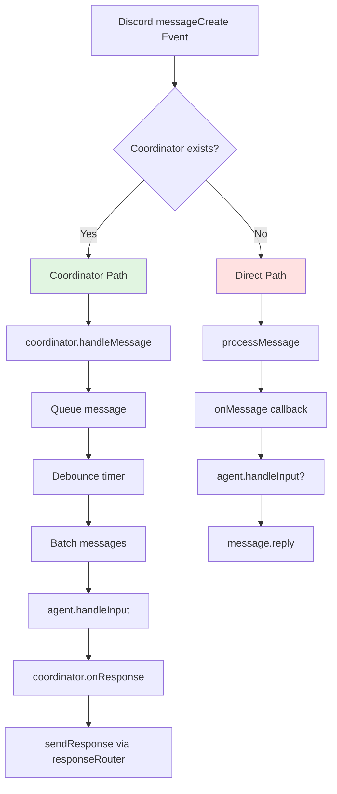
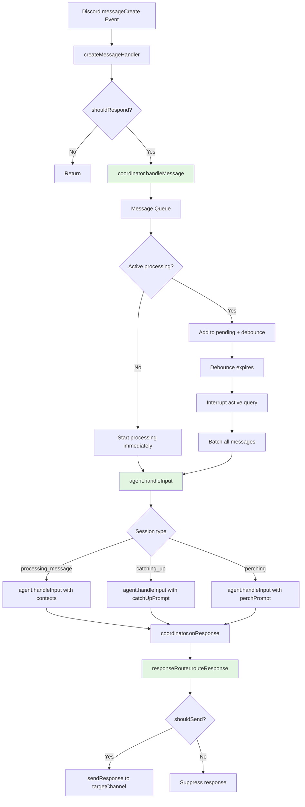

# Unify Message Processing Path

## Problem Statement

Isambard currently has **two different code paths** for processing Discord messages:

1. **Direct path** (backward compatibility): `onMessage` callback → `agent.handleInput()` → direct reply
2. **Coordinator path** (new): `handleMessage` → message batching → `agent.handleInput()` → coordinator's `onResponse`

**Problems with dual path:**
- Same message can be processed differently depending on code path
- Coordinator is optional, creating inconsistent behavior
- Direct path bypasses batching and interruption handling
- Presence updates behave differently in each path
- Testing requires covering both paths
- Future features (multi-message context) won't work in direct path

**Code evidence:**
- `handlers.ts` line 332: `coordinator ? coordinator.handleMessage() : await processMessage()`
- `bot.ts` line 232: `onMessage` callback still exists for backward compatibility
- `message-coordinator.ts`: Full coordinator with batching, but not always used

## Current Architecture



## Proposed Architecture

Single unified path through coordinator:



## CommunicationPlatform Interface Design

Future-proof design for multi-platform support:

```typescript
/**
 * Generic communication platform interface.
 * Discord is the first implementation; future platforms (Slack, Matrix, etc.) follow same contract.
 */
export interface CommunicationPlatform {
    /** Platform name for logging and debugging */
    readonly name: string

    /**
     * Get all destinations this platform can send to.
     * For Discord: channels (text, voice, DM) and threads.
     * For Slack: channels and DMs.
     * For Matrix: rooms.
     */
    getAvailableDestinations(): Promise<Destination[]>

    /**
     * Deliver a message to a destination.
     * Handles platform-specific formatting, rate limiting, splitting long messages.
     */
    deliverMessage(dest: Destination, message: string): Promise<void>

    /**
     * Subscribe to incoming events (messages, reactions, etc.).
     * Platform pushes events to handler function.
     */
    subscribeToEvents(handler: (event: IncomingEvent) => void): void

    /**
     * Platform lifecycle management.
     */
    start(): Promise<void>
    stop(): Promise<void>
}

/**
 * Generic destination (channel, DM, thread, room).
 */
export interface Destination {
    /** Platform-specific destination ID */
    id: string

    /** Human-readable name */
    name: string

    /** Destination type (channel, dm, thread, etc.) */
    type: DestinationType

    /** Parent destination (for threads) */
    parentId?: string

    /** Guild/server/workspace ID */
    guildId?: string
}

/**
 * Generic incoming event.
 */
export interface IncomingEvent {
    /** Event type (message, reaction, etc.) */
    type: 'message' | 'reaction' | 'edit' | 'delete'

    /** Source destination */
    destinationId: string

    /** User who triggered event */
    userId: string

    /** Event-specific payload */
    payload: MessagePayload | ReactionPayload | EditPayload | DeletePayload

    /** Event timestamp */
    timestamp: string
}

/**
 * Message payload.
 */
export interface MessagePayload {
    /** Message ID */
    messageId: string

    /** Message content */
    content: string

    /** Attachments (images, files) */
    attachments?: Attachment[]

    /** Referenced message (for replies) */
    referencedMessageId?: string
}
```

**Benefits:**
- Discord becomes one implementation of `CommunicationPlatform`
- Agent layer doesn't know about Discord-specific details
- Adding Slack/Matrix/etc. just implements the interface
- Response routing works across platforms

## Implementation Steps

### Step 1: Remove Direct Path in handlers.ts

**Current code (line 332):**
```typescript
if(coordinator) {
    coordinator.handleMessage(context, message, channel);
} else {
    await processMessage(message);
}
```

**Change to:**
```typescript
// Always use coordinator - no direct path
coordinator.handleMessage(context, message, channel);
```

**Files changed:**
- `src/integrations/discord/handlers.ts`

**Tests:**
- Update handler tests to always expect coordinator path
- Remove tests for direct path

### Step 2: Remove onMessage Callback Pattern from Bot

**Current code (bot.ts line 232):**
```typescript
const bot: DiscordBot = createDiscordBot({
    config: config.discord,
    onMessage: async (context) => {
        const result = await agent.handleInput([context]);
        return result.response;
    },
    // ... other options
});
```

**Change to:**
```typescript
const bot: DiscordBot = createDiscordBot({
    config: config.discord,
    agent, // Pass agent directly, not onMessage callback
    // ... other options
});
```

**Files changed:**
- `src/index.ts` (createApp)
- `src/integrations/discord/bot.ts` (DiscordBotOptions interface)

**Tests:**
- Update bot tests to not use onMessage callback
- Verify agent wiring works correctly

### Step 3: Make Coordinator Mandatory

**Current code:**
```typescript
coordinator?: MessageCoordinator
```

**Change to:**
```typescript
coordinator: MessageCoordinator // Always required
```

**Files changed:**
- `src/integrations/discord/handlers.ts` (MessageHandlerOptions)
- `src/integrations/discord/bot.ts` (always create coordinator)

**Impact:**
- Coordinator always exists
- Simplifies handler logic (no optional check)
- All messages get batching and interruption handling

### Step 4: Move Message Queueing from Coordinator to Agent

**Rationale:** Message queueing is agent-level concern, not Discord-specific

**Current:** Coordinator tracks per-channel queues
**Proposed:** Agent tracks per-conversation queues

**New agent method:**
```typescript
interface ClaudeAgent {
    /**
     * Handle incoming input from any platform.
     * Queues messages, batches rapid inputs, handles interruption.
     */
    handleInput(input: AgentInput, options?: HandleInputOptions): Promise<AgentResponse>
}

interface AgentInput {
    /** Conversation ID (maps to Discord channel, Slack thread, etc.) */
    conversationId: string

    /** Message contexts (one or more batched messages) */
    contexts: MessageContext[]

    /** Optional attachments */
    attachments?: Attachment[]

    /** Optional resume context (for interrupted sessions) */
    resumeContext?: ResumeContext
}
```

**Benefits:**
- Platform-agnostic message handling
- Agent owns interruption and batching logic
- Coordinator becomes thin adapter: Discord events → Agent inputs

**Files changed:**
- `src/agent/agent.ts` (add `handleInput` method)
- `src/integrations/discord/message-coordinator.ts` (simplify to adapter)

### Step 5: Define CommunicationPlatform Interface

**Files:**
- Create `src/integrations/communication-platform.ts`
- Export `CommunicationPlatform` interface and types
- Document contract for future implementations

**Discord implementation:**
```typescript
export class DiscordPlatform implements CommunicationPlatform {
    readonly name = 'discord'

    async getAvailableDestinations(): Promise<Destination[]> {
        // Use channel registry
    }

    async deliverMessage(dest: Destination, message: string): Promise<void> {
        // Use rate limiter + response sender
    }

    subscribeToEvents(handler: (event: IncomingEvent) => void): void {
        // Register Discord.js event handlers
    }

    async start(): Promise<void> { /* ... */ }
    async stop(): Promise<void> { /* ... */ }
}
```

**Agent integration:**
```typescript
interface ClaudeAgent {
    /**
     * Register a communication platform.
     * Agent routes responses back through registered platforms.
     */
    registerPlatform(platform: CommunicationPlatform): void
}
```

## Benefits

**Consistency:**
- All messages processed the same way
- No code path ambiguity
- Predictable behavior for users

**Simplicity:**
- Remove optional coordinator logic
- Single code path to test and maintain
- Clearer control flow

**Platform-Agnostic Agent:**
- Agent doesn't know about Discord specifics
- Easy to add Slack, Matrix, etc.
- Response routing works across platforms

**Future Features:**
- Multi-message context works everywhere (not just coordinator path)
- Interruption handling unified
- Batching logic in one place

## Testing Strategy

**Unit Tests:**
- Test coordinator as mandatory (not optional)
- Test agent.handleInput() with batched contexts
- Test platform interface implementations

**Integration Tests:**
- End-to-end message processing through unified path
- Verify interruption and batching work
- Test response routing

**Regression Tests:**
- Existing message handling behavior preserved
- Catch-up mode still works
- Perch mode still works

## Risks and Mitigation

**Risk 1: Breaking existing behavior**
- Mitigation: Extensive integration tests before removing direct path
- Verify coordinator path produces same results as direct path

**Risk 2: Performance regression**
- Mitigation: Benchmark message processing latency
- Ensure coordinator doesn't add significant overhead

**Risk 3: Error handling changes**
- Mitigation: Coordinator propagates errors same as direct path
- Test error paths explicitly

**Risk 4: Hot reload compatibility**
- Mitigation: Test hot reload with mandatory coordinator
- Verify no duplicate handler registration
