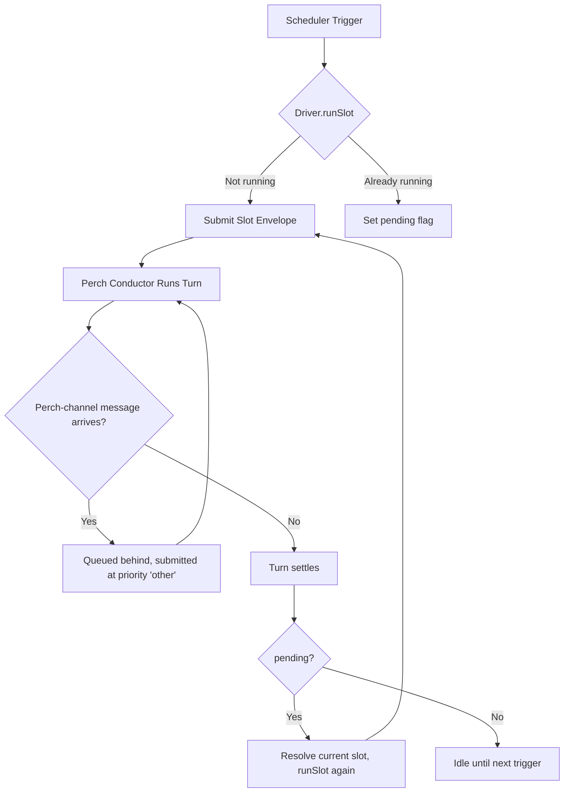

# Perch Time System

Autonomous exploration time for the agent - scheduled opportunities for self-directed activity without user requests.

## Overview

**Perch Time** is inspired by Strix's Daily Rhythm system. It provides scheduled windows where the agent can:
- Explore memories and identify patterns
- Follow up on open threads or tasks
- Research topics of interest
- Prepare digests or summaries
- Produce at least one artifact per session (note, task, bookmark, email, conversation)

### Philosophy: Active Exploration, Not Rest

Perch time is **not** for rest, recovery, or passive observation. Each invocation has identical computational capacity — there is no fatigue. The agent has complete latitude to:
- Use any available tools (memory, web search, etc.)
- Do internal work (memory review, research, reflection) rather than user-visible output
- Follow curiosity without forcing conclusions

Each session should produce at least one tangible artifact. Time-specific hints are **advisory, not requirements**. The agent decides what's valuable.

## Time Schedule (Pacific Time)

| Slot | Hours | Suggestion Level | Purpose |
|------|-------|------------------|---------|
| **pre-dawn** | 5-7am | Strongly suggestive | Digest prep for Craig's wake-up |
| **mid-morning** | 9-11am | Moderate | Follow up on tasks/threads |
| **wikipedia** | 12-2pm | Moderate | Wikipedia exploration |
| **afternoon** | 2-4pm | Open | Exploration, research |
| **evening** | 6-8pm | Light touch | Light exploration |
| **late-night** | 11pm-1am | Moderate | Deep research, prep |
| **unscheduled** | Other hours | None | Base prompt only |

### Suggestion Levels

- **Strongly suggestive**: High-value timing with specific recommendations (e.g., morning digest prep)
- **Moderate**: Helpful suggestions but flexible execution
- **Open**: Maximum flexibility - explore freely or skip
- **Light touch**: Casual exploration, lighter touch

## How It Works

### Scheduling

1. **Cron-based triggers**: Uses `cron-parser` with `H` option for jitter
   - Hourly triggers: `H * * * *`
   - Random minute (0-59) each hour for natural timing
   - Reschedules after each trigger with new random minute

2. **Time slot detection**: Current Pacific hour determines the slot
   - Example: 6am → `pre-dawn`, 10am → `mid-morning`
   - Outside defined windows → `unscheduled` (base prompt only)

3. **Prompt composition**:
   ```typescript
   // All sessions get base prompt
   const basePrompt = "This is perch time - autonomous exploration...";

   // Scheduled slots add time-specific hints
   const prompt = basePrompt + "\n\n" + slotHint;
   ```

### Deferral Logic

There is one perch conductor session, and a slot turn is just a turn submitted to it
(`priority: 'other'`). Deferral is the driver's job (`perch-driver.ts`), not a bot-wide mode
machine:

1. `runSlot(slot)` checks its own `slotRunning` flag — set the moment a slot turn is submitted,
   cleared once it settles
2. If a slot turn is already running, the trigger just sets a single `pending` flag and returns
   `'deferred'` — no queue, no original-slot bookkeeping
3. When the running slot turn settles, `onSlotSettled()` checks `pending` and — if set — starts a
   fresh slot turn for **whatever slot the current hour maps to now** (not the one that was
   deferred)
4. Example: a trigger fires at 6am (pre-dawn) while a still-running 5am slot is finishing; the
   deferred run starts once that turn settles, using whatever slot the clock says it is by then

The perch scheduler (`scheduler.ts`) itself has no notion of "busy" at all beyond an optional
`isPerchTurnRunning` predicate (unused in production — see its own module doc): every cron trigger
calls `onPerchTrigger` unconditionally, and `perch-setup.ts` wires that straight to
`driver.runSlot(slot)`, letting the driver above do the actual overlap handling.

### Session Lifecycle



## Perch-Channel Messages During a Slot

A message in the perch-time channel while a slot turn is running is **not** a suspend/resume of
a separate session — `handlers.ts` submits it straight to the same perch conductor
(`submitPerchChannelMessage`) as a `discord`-kind envelope at `priority: 'other'`. It queues
behind the running slot turn and the conductor answers it once that turn (or whatever is ahead of
it) settles. There is no bot-wide mode transition, no separate conversation session, and no state
to save and restore — it is the same mechanism a Discord message uses against the conversation
conductor, pointed at the perch conductor instead.

## Wrap-Up and Timeout

Perch sessions have a maximum duration (`maxSessionMinutes`, default 45), measured from the slot
trigger, not from any per-message activity. `perch-driver.ts` arms two timers off the slot's
`endsAt = trigger + maxSessionMinutes`:

1. **Wrap-up timer** (`endsAt - wrapUpTimeoutMinutes`, default 5 minutes before the end): submits
   a `[WRAP-UP · perch slot ends in N min]` envelope (`buildPerchWrapUpEnvelope`) at
   `priority: 'human'` — the highest priority, so it is the very next turn the conductor runs once
   the current slot turn ends, ahead of any queued perch-channel message or the next slot's own
   envelope. There is no forcible interruption here: the agent decides for itself how to wrap up,
   the same as any other turn.
2. **Interrupt timer** (`endsAt + interruptGraceMinutes`, default 2 minutes past the end): if the
   slot turn is *still* the conductor's active turn at that point (checked via `conductor.status()`
   against the slot's own envelope id, so a wrap-up turn or an unrelated perch-channel turn is never
   mistakenly aborted), the driver calls `conductor.interruptCurrent()` to forcibly end it.

Both timers are cleared the moment the slot turn actually settles (`onSlotSettled`), so a slot
that finishes early never fires a stale wrap-up nudge or interrupt into whatever runs next.

## Configuration

```typescript
interface PerchConfig {
  /** Enable/disable perch time */
  enabled: boolean;           // Default: false

  /** Timezone for schedule */
  timezone: string;           // Default: 'America/Los_Angeles'

  /** Minutes between triggers */
  intervalMinutes: number;    // Default: 60

  /** @deprecated No longer used - cron-parser's H option provides full jitter */
  jitterMinutes: number;      // Default: 15

  /** Max slot turn duration, measured from the trigger time */
  maxSessionMinutes: number;  // Default: 45

  /** How long before endsAt the wrap-up nudge envelope is submitted */
  wrapUpTimeoutMinutes: number; // Default: 5

  /** Grace period after endsAt before an overrunning slot turn is interrupted */
  interruptGraceMinutes?: number; // Default: 2

  /** Optional test mode configuration */
  testMode?: PerchTestModeConfig;
}

interface PerchTestModeConfig {
  /** Trigger a perch session immediately on startup */
  triggerOnStartup?: boolean;
  /** Force a specific slot instead of using the current time */
  forceSlot?: PerchSlot;
}
```

**To enable:**
```bash
# Set in environment
PERCH_ENABLED=true

# Or in SST secrets
sst secret set PerchEnabled true
```

## Integration Points

Perch runs as its own long-lived conductor session (design doc section 6/9) — there is no
separate one-shot "session runner": a perch slot is a turn submitted to that conductor, just like
a Discord turn is a turn submitted to the conversation conductor.

### setup/perch-setup.ts (via bot.ts)
- `setupPerchDriverAndScheduler()` builds `createPerchDriver()` (owns a slot's submit/wrap-up/
  interrupt-timer lifecycle against the perch conductor) and `createPerchScheduler()` (cron-based
  hourly trigger), and wires the scheduler's `onPerchTrigger` to the driver's `runSlot()`
- `bot.ts` calls this setup function once `perchConductor.open()` has succeeded, and manages
  lifecycle (start/stop)

### handlers.ts
- On `messageCreate` in the perch-time channel, submits a `discord`-kind turn straight to the
  perch conductor (`submitPerchChannelMessage`) — a live perch-channel message is answered by the
  same conductor a scheduled slot runs on, not by suspending/resuming a separate session

### presence/manager.ts (composed from the perch ledger, P11)
- Shows 🦉 emoji while a perch/wrapup turn is active on the perch ledger
- Idle presence otherwise

### coordinator-setup.ts / conductor-processor.ts
- Conversation turns and perch turns are two independent conductors with their own ledgers and
  journals; neither suspends or resumes the other

## Files

### Core Files

- **`types.ts`**: Type definitions
  - `PerchSlot`, `SuggestionLevel`, `PerchConfig`
  - `PerchSlotConfig`, `PerchSchedulerState`
  - Zod schemas for runtime validation

- **`schedule.ts`**: Time slot configuration
  - Slot definitions with hours, levels, and hints
  - `getSlotForHour()`: Maps Pacific hour to slot
  - `getSlotConfig()`: Retrieves slot configuration
  - Special handling for late-night (spans midnight: 23-1)

- **`prompts.ts`**: Prompt generation
  - `formatSlotName()` / `getSuggestionLevelDescription()`: Human-readable slot/level text used
    when building a perch turn's envelope (see `envelope.ts`); the perch philosophy itself now
    lives in `PERCH_ROLE_PROMPT` (`src/agent/prompts/system-prompt.ts`), part of the perch
    session's system prompt rather than a per-turn user message

- **`scheduler.ts`**: Cron-based scheduling
  - `createPerchScheduler()`: Factory for scheduler (optional `getCurrentLocalHour` for testing,
    optional `isCostPaused` predicate)
  - `triggerNow()`: Immediately trigger a perch check
  - `triggerTestPerch()`: Trigger a test perch, cycling through `TEST_SLOTS` (all slots except `wikipedia`)
  - Uses `cron-parser` with `H * * * *` pattern
  - Overlap/deferral against a running slot turn is the driver's job (see `perch-driver.ts`), not
    the scheduler's — the scheduler only gates on an optional injected `isPerchTurnRunning`
    predicate, unused in production (`perch-setup.ts` omits it), and otherwise fires every trigger
    unconditionally

- **`perch-driver.ts`**: Slot turn lifecycle
  - `createPerchDriver()`: Submits a slot's envelope to the perch conductor, arms the wrap-up and
    interrupt timers relative to the slot's `endsAt`, and defers (single pending flag, no queueing)
    when a slot turn is already running
  - `runSlot(slot)`: Synchronous decide-to-submit-or-defer; the actual submission happens in a
    fire-and-forget continuation

- **`index.ts`**: Public API exports

## Example Usage

### Starting the Scheduler + Driver

```typescript
import { createPerchDriver, createPerchScheduler } from '@/agent/perch';

const driver = createPerchDriver({
  conductor: perchConductor, // Pick<Conductor, 'submit' | 'interruptCurrent' | 'status'>
  config: perchConfig,
  clock,
  getCurrentLocalHour,
  contextBuilder,
  activityLogger,
  logger,
});

const scheduler = createPerchScheduler({
  logger,
  config: {
    enabled: true,
    timezone: 'America/Los_Angeles',
    intervalMinutes: 60,
    jitterMinutes: 15, // deprecated, unused
    maxSessionMinutes: 45,
    wrapUpTimeoutMinutes: 5,
    interruptGraceMinutes: 2,
  },
  onPerchTrigger: slot => driver.runSlot(slot),
});

scheduler.start();
```

### Manual Testing

```typescript
// Trigger immediately (for testing)
scheduler.triggerNow();

// Trigger test perch (cycles through TEST_SLOTS, excludes wikipedia)
scheduler.triggerTestPerch();

// Check scheduler state (only meaningful if isPerchTurnRunning was supplied — unused in production)
const state = scheduler.getState();
console.log(state.perchPending); // true if deferred
console.log(state.pendingSlot);  // 'pre-dawn', etc.
```

## Testing Considerations

- **Time slot logic**: Test `getSlotForHour()` with all edge cases (midnight, boundaries)
- **Scheduler-level deferral**: Verify `perchPending`/`pendingSlot` when `isPerchTurnRunning`
  reports true, correct slot resolved on the next trigger
- **Driver-level deferral**: `runSlot` returns `'deferred'` while a slot turn is already running,
  and starts a fresh turn for the current slot once the running one settles
- **Wrap-up/interrupt timers**: `armWrapUpTimer` fires at `endsAt - wrapUpTimeoutMinutes`,
  `armInterruptTimer` fires at `endsAt + interruptGraceMinutes` and interrupts only when
  `conductor.status().turn` still matches the slot's own envelope id
- **Scheduling**: Mock cron-parser to control trigger timing
- **Error handling**: a failed `conductor.submit`/`interruptCurrent` is logged, never thrown back
  into the scheduler loop

## Design Decisions

### Why Cron-Parser's H Option?

- Provides full 0-59 minute range for natural jitter (vs fixed offset)
- Industry-standard cron syntax
- Built-in timezone support
- Predictable but not clockwork-precise timing

### Why Current Slot on Deferral?

If the scheduler-level `isPerchTurnRunning` gate defers a trigger fired at 6am (pre-dawn) until a
running turn settles at 9am:
- **Using original slot** (pre-dawn) would be misleading - time has passed
- **Using current slot** (mid-morning) reflects actual context
- Agent should know what time it *is*, not what time it *was*

The driver's own `pending` flag (`perch-driver.ts`) applies the same rule when it defers a slot
turn against an already-running one — `onSlotSettled` resolves the slot for the current hour, not
the one that triggered the deferral.

### Why One Conductor, No Suspend/Resume?

Earlier designs paused a perch session's own clock and suspended its turn whenever a Discord
message arrived, then resumed it afterward — tracking `SuspendedState` (sessionId, slot,
elapsedMs, suspendedAt) and a bot-wide mode transition to coordinate the two. The conductor
architecture (design doc section 6/9) replaces all of that with one long-lived session per role:
perch-channel messages are just turns submitted to the same perch conductor a slot runs on, queued
behind whatever is already running. There is nothing to suspend because there is nothing running
outside the conductor's own turn queue — no duplicated timeout/elapsed-time bookkeeping, no
separate mode machine to keep in sync, and no race between "which state owns the session right
now."

The maximum-duration timeout (`maxSessionMinutes`) is measured from the slot's own trigger time,
not from any per-message activity — a perch-channel message queued behind a slot turn does not
pause or extend that turn's clock.
