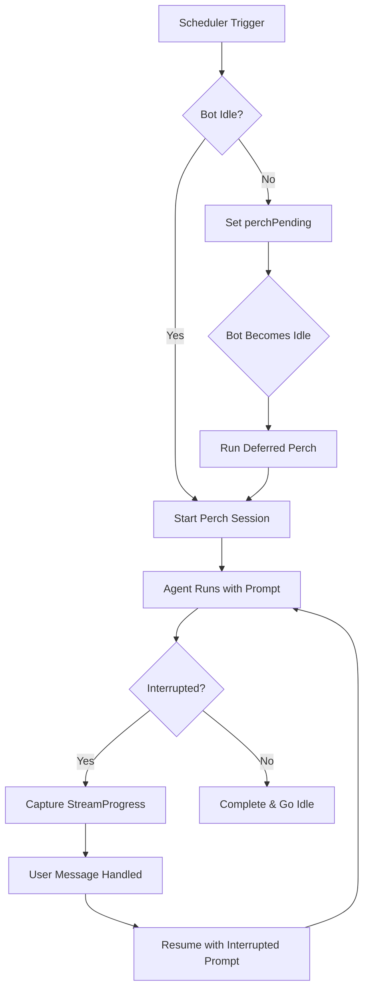

# Perch Time System

Autonomous exploration time for the agent - scheduled opportunities for self-directed activity without user requests.

## Overview

**Perch Time** is inspired by Strix's Daily Rhythm system. It provides scheduled windows where the agent can:
- Explore memories and identify patterns
- Follow up on open threads or tasks
- Research topics of interest
- Prepare digests or summaries
- Or simply observe - **output is optional**

### Philosophy: Exploration, Not Task Time

Perch time is **not** for completing tasks or producing deliverables. It's for autonomous exploration and discovery. The agent has complete latitude to:
- Use any available tools (memory, web search, etc.)
- Explore without obligation to produce user-facing output
- Skip the session entirely if nothing calls for attention

Time-specific hints are **advisory, not requirements**. The agent decides what's valuable.

## Time Schedule (Pacific Time)

| Slot | Hours | Suggestion Level | Purpose |
|------|-------|------------------|---------|
| **pre-dawn** | 5-7am | Strongly suggestive | Digest prep for Craig's wake-up |
| **mid-morning** | 9-11am | Moderate | Follow up on tasks/threads |
| **afternoon** | 1-3pm | Open | Exploration, research |
| **evening** | 6-8pm | Light touch | Light exploration |
| **late-night** | 11pm-1am | Moderate | Deep research, prep |
| **unscheduled** | Other hours | None | Base prompt only |

### Suggestion Levels

- **Strongly suggestive**: High-value timing with specific recommendations (e.g., morning digest prep)
- **Moderate**: Helpful suggestions but flexible execution
- **Open**: Maximum flexibility - explore freely or skip
- **Light touch**: Optional activity, can skip entirely

## How It Works

### Scheduling

1. **Cron-based triggers**: Uses `cron-parser` with `H` option for jitter
   - Hourly triggers: `H * * * *`
   - Random minute (0-59) each hour for natural timing
   - Reschedules after each trigger with new random minute

2. **Time slot detection**: Current Pacific hour determines the slot
   - Example: 6am → `pre-dawn`, 10am → `mid-morning`
   - Outside defined windows → `unscheduled` (base prompt only)

3. **Prompt composition**:
   ```typescript
   // All sessions get base prompt
   const basePrompt = "This is perch time - autonomous exploration...";

   // Scheduled slots add time-specific hints
   const prompt = basePrompt + "\n\n" + slotHint;
   ```

### Deferral Logic

**If bot is busy when trigger fires:**
1. Scheduler sets `perchPending: true` and stores `pendingSlot`
2. Subscribes to `BotStateManager` for mode transitions
3. When bot becomes idle, triggers perch with **current time slot** (not original)
4. Example: Trigger at 6am (pre-dawn) deferred, runs at 9am (mid-morning)

**Busy states that defer perch:**
- `catching_up`: Processing backlog of Discord messages
- `processing_message`: Handling active user message
- `perching` with `interrupted: true`: Already in interrupted perch

### Session Lifecycle



## Interruption Handling

### When User Messages Arrive

If a message arrives during perch time:

1. **Capture context**: StreamProgress stores thinking, text, and pending tool use
2. **Interrupt session**: `BotStateManager.interrupt(messageDetails)` called
3. **Abort signal fired**: Agent stream stops gracefully
4. **Handle message**: Bot processes user message normally
5. **Resume perch**: After response sent, resume with same `sessionId`

### Interrupted Prompt

When resuming, agent receives context about both streams of thought:

```
--- PERCH TIME INTERRUPTED ---

You were in autonomous perch time when a new message arrived.

[Your thinking at interruption:]
{captured thinking text}

[You were composing:]
{partial response text}

[You were about to use "tool-name"]

--- NEW MESSAGE ---
From: User in #channel
{message content}
---

## What To Do
The message above has already been handled by your normal conversation flow.
You do NOT need to respond to it again.

1. Review the message for context (it may affect your perch work)
2. Check TaskList to see what you were working on before the interruption
3. Continue your perch work, adjusting priorities if the message changes things

Trust TaskList as your source of truth - sessions are transient, tasks are durable.
```

### Session Continuity

- Same `sessionId` used across interruption/resumption
- Agent maintains context across the entire perch window
- Multiple interruptions possible within one perch session

## Configuration

```typescript
interface PerchConfig {
  /** Enable/disable perch time */
  enabled: boolean;           // Default: false

  /** Timezone for schedule */
  timezone: string;           // Default: 'America/Los_Angeles'

  /** Minutes between triggers */
  intervalMinutes: number;    // Default: 60

  /** @deprecated No longer used - cron-parser's H option provides full jitter */
  jitterMinutes: number;      // Default: 15

  /** Max session duration */
  maxSessionMinutes: number;  // Default: 45
}
```

**To enable:**
```bash
# Set in environment
PERCH_ENABLED=true

# Or in SST secrets
sst secret set PerchEnabled true
```

## Integration Points

### setup/perch-setup.ts (via bot.ts)
- `setupPerchSessionRunnerAndScheduler()` initializes `PerchScheduler` with dependencies
- Wires `onPerchTrigger` callback to `PerchSessionRunner.startPerch()`
- `bot.ts` calls this setup function and manages lifecycle (start/stop)

### handlers.ts
- On `messageCreate`, checks if bot is in perching mode
- Calls `PerchSessionRunner.interrupt()` with message details
- Message coordinator ensures perch resume happens after response

### state/manager.ts
- Tracks `perching` mode with `PerchingModeContext`
- Stores `interrupted` flag and `interruptingMessage` details
- Provides `interrupt()`, `resume()`, `isInterrupted()` methods
- **Single source of truth** for perch state

### presence/manager.ts
- Shows 🦉 emoji when in `perching` mode
- Shows 🦉💬 when perching and interrupted
- Updates status text based on perch activity

## Files

### Core Files

- **`types.ts`**: Type definitions
  - `PerchSlot`, `SuggestionLevel`, `PerchConfig`
  - `PerchSlotConfig`, `PerchSchedulerState`
  - Zod schemas for runtime validation

- **`schedule.ts`**: Time slot configuration
  - Slot definitions with hours, levels, and hints
  - `getSlotForHour()`: Maps Pacific hour to slot
  - `getSlotConfig()`: Retrieves slot configuration
  - Special handling for late-night (spans midnight: 23-1)

- **`prompts.ts`**: Prompt generation
  - `BASE_PROMPT`: Core perch philosophy
  - `buildPerchPrompt(slot)`: Combines base + slot hint
  - `buildPerchInterruptedPrompt()`: Resume context
  - `getSuggestionLevelDescription()`: Human-readable levels

- **`scheduler.ts`**: Cron-based scheduling
  - `createPerchScheduler()`: Factory for scheduler
  - Uses `cron-parser` with `H * * * *` pattern
  - Handles deferral when bot busy
  - Subscribes to `BotStateManager` for idle transitions

- **`session-runner.ts`**: Session lifecycle
  - `createPerchSessionRunner()`: Factory for runner
  - `startPerch(slot)`: Begins session with slot-specific prompt
  - `interrupt(message)`: Captures context and aborts
  - `resumeAfterInterruption()`: Continues with interrupted prompt
  - Error handling and state cleanup

- **`index.ts`**: Public API exports

## Example Usage

### Starting the Scheduler

```typescript
import { createPerchScheduler } from '@/agent/perch';

const scheduler = createPerchScheduler({
  stateManager,
  logger,
  config: {
    enabled: true,
    timezone: 'America/Los_Angeles',
    intervalMinutes: 60,
    jitterMinutes: 15,
    maxSessionMinutes: 45,
  },
  onPerchTrigger: async (slot) => {
    await sessionRunner.startPerch(slot);
  },
});

scheduler.start();
```

### Running a Session

```typescript
import { createPerchSessionRunner } from '@/agent/perch';

const runner = createPerchSessionRunner({
  stateManager,
  logger,
  runAgentSession: async ({ prompt, sessionId, abortSignal }) => {
    // Your agent execution logic
    const abortController = new AbortController();
    abortSignal.addEventListener('abort', () => abortController.abort(), { once: true });
    const result = await agent.handleInput([], {
      specialMode: 'perching',
      perchPrompt: prompt,
      sessionId,
      abortController,
    });
    return { completed: !result.wasInterrupted, sessionId: result.sessionId };
  },
});

// Start perch for current slot
await runner.startPerch('pre-dawn');

// Handle interruption
runner.interrupt({
  channelId: '...',
  author: 'Craig',
  channelName: 'general',
  content: 'Quick question...',
});

// Resume after responding
await runner.resumeAfterInterruption();
```

### Manual Testing

```typescript
// Trigger immediately (for testing)
scheduler.triggerNow();

// Check scheduler state
const state = scheduler.getState();
console.log(state.perchPending); // true if deferred
console.log(state.pendingSlot);  // 'pre-dawn', etc.
```

## Testing Considerations

- **Time slot logic**: Test `getSlotForHour()` with all edge cases (midnight, boundaries)
- **Deferral**: Verify pending state when bot busy, correct slot on resume
- **Interruption**: Ensure StreamProgress captured, session resumed with same ID
- **Scheduling**: Mock cron-parser to control trigger timing
- **Error handling**: Test abort signals, network failures, state recovery

## Design Decisions

### Why Cron-Parser's H Option?

- Provides full 0-59 minute range for natural jitter (vs fixed offset)
- Industry-standard cron syntax
- Built-in timezone support
- Predictable but not clockwork-precise timing

### Why Current Slot on Deferral?

If trigger fires at 6am (pre-dawn) but bot is busy until 9am:
- **Using original slot** (pre-dawn) would be misleading - time has passed
- **Using current slot** (mid-morning) reflects actual context
- Agent should know what time it *is*, not what time it *was*

### Why Same SessionId on Resume?

- Preserves conversation context across interruption
- Agent can reference earlier thinking
- More coherent multi-interrupt sessions
- Matches user expectation of continuous perch "session"

### Why BotStateManager as Single Source of Truth?

- No duplicate state between scheduler, runner, and state manager
- Clear ownership: BotStateManager owns all mode/interrupt state
- Prevents race conditions and state drift
- Simplifies testing - one place to verify state
