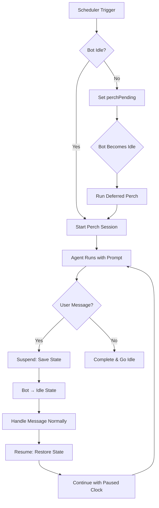

# Perch Time System

Autonomous exploration time for the agent - scheduled opportunities for self-directed activity without user requests.

## Overview

**Perch Time** is inspired by Strix's Daily Rhythm system. It provides scheduled windows where the agent can:
- Explore memories and identify patterns
- Follow up on open threads or tasks
- Research topics of interest
- Prepare digests or summaries
- Produce at least one artifact per session (note, task, bookmark, email, conversation)

### Philosophy: Active Exploration, Not Rest

Perch time is **not** for rest, recovery, or passive observation. Each invocation has identical computational capacity — there is no fatigue. The agent has complete latitude to:
- Use any available tools (memory, web search, etc.)
- Do internal work (memory review, research, reflection) rather than user-visible output
- Follow curiosity without forcing conclusions

Each session should produce at least one tangible artifact. Time-specific hints are **advisory, not requirements**. The agent decides what's valuable.

## Time Schedule (Pacific Time)

| Slot | Hours | Suggestion Level | Purpose |
|------|-------|------------------|---------|
| **pre-dawn** | 5-7am | Strongly suggestive | Digest prep for Craig's wake-up |
| **mid-morning** | 9-11am | Moderate | Follow up on tasks/threads |
| **wikipedia** | 12-2pm | Moderate | Wikipedia exploration |
| **afternoon** | 2-4pm | Open | Exploration, research |
| **evening** | 6-8pm | Light touch | Light exploration |
| **late-night** | 11pm-1am | Moderate | Deep research, prep |
| **unscheduled** | Other hours | None | Base prompt only |

### Suggestion Levels

- **Strongly suggestive**: High-value timing with specific recommendations (e.g., morning digest prep)
- **Moderate**: Helpful suggestions but flexible execution
- **Open**: Maximum flexibility - explore freely or skip
- **Light touch**: Casual exploration, lighter touch

## How It Works

### Scheduling

1. **Cron-based triggers**: Uses `cron-parser` with `H` option for jitter
   - Hourly triggers: `H * * * *`
   - Random minute (0-59) each hour for natural timing
   - Reschedules after each trigger with new random minute

2. **Time slot detection**: Current Pacific hour determines the slot
   - Example: 6am → `pre-dawn`, 10am → `mid-morning`
   - Outside defined windows → `unscheduled` (base prompt only)

3. **Prompt composition**:
   ```typescript
   // All sessions get base prompt
   const basePrompt = "This is perch time - autonomous exploration...";

   // Scheduled slots add time-specific hints
   const prompt = basePrompt + "\n\n" + slotHint;
   ```

### Deferral Logic

**If bot is busy when trigger fires:**
1. Scheduler sets `perchPending: true` and stores `pendingSlot`
2. Subscribes to `BotStateManager` for mode transitions
3. When bot becomes idle, triggers perch with **current time slot** (not original)
4. Example: Trigger at 6am (pre-dawn) deferred, runs at 9am (mid-morning)

**Busy states that defer perch:**
- `catching_up`: Processing backlog of Discord messages
- `processing_message`: Handling active user message
- `perching`: Already in active perch session

**Suspension guard:**
- Scheduler checks `isSuspended()` before starting new perch
- Won't start if perch is currently suspended (waiting to resume)

### Session Lifecycle



## Suspension Handling

### When User Messages Arrive

If a message arrives during perch time:

1. **Save state**: `suspend()` stores `sessionId`, `slot`, `elapsedMs`, and `suspendedAt`
2. **Transition to idle**: Bot state changes from `perching` to `idle`
3. **Abort signal fired**: Agent stream stops gracefully
4. **Handle message normally**: Message coordinator processes message in standard `idle→processing_message` flow
5. **Pass context note**: Message handler receives note: "Note: This message arrived during perch-time..."
6. **Resume after response**: `resumeAfterSuspension()` restores state and continues perch

### Key Differences from Old Model

**OLD (Interruption):**
- Bot stayed in `perching+interrupted` state during message handling
- Timeout kept ticking (wall-clock based)
- Resumed prompt included partialWork + user message content
- Single state machine with interrupted flag

**NEW (Suspension):**
- Bot transitions to `idle` state during suspension
- Timeout clock **pauses** (tracks elapsed perch time, not wall clock)
- Resumed prompt is lightweight (no partialWork, no user message)
- Clear separation: perch session vs. message session

### Suspended State

The session runner tracks suspension state:

```typescript
interface SuspendedState {
  sessionId: string;          // Same session continues
  slot: PerchSlot;           // Original time slot
  elapsedMs: number;         // How much perch time used so far
  suspendedAt: Date;         // When suspension happened
  interruptingMessage: InterruptingMessage; // The message that caused suspension
}
```

**Guaranteed minimum time on resume:** At least 1 minute (`Math.max(maxMs - elapsedMs, 60_000)`)

### Resumed Prompt

When resuming, agent receives a clean, lightweight prompt:

```
[Current time: Saturday, February 15, 2026 at 2:30 PM Pacific]

--- PERCH TIME RESUMED ---

You were suspended for approximately 15 minutes while a user message was handled in a separate conversation session.

[While you were suspended:]
- A message from Craig in #general was handled separately
- 2 new events were logged to your memory

Continue your perch work from where you left off. Check TaskList for your active tasks.
Trust TaskList as your source of truth — sessions are transient, tasks are durable.
```

**Why no partialWork?**
- Session history already contains prior thinking (same `sessionId`)
- No need to repeat what's already in context

**Why no user message content?**
- Message was handled in a separate conversation session
- Avoids confusion about needing to respond
- Keeps perch focus clean

### Session Continuity

- Same `sessionId` preserved across suspension/resumption
- Elapsed time tracked independently of wall-clock time
- Clock pauses during suspension, resumes with remaining time
- Multiple suspensions possible within one perch session
- Session history maintains coherent conversation thread

## Timeout System

### Session Timeout

Perch sessions have a maximum duration (`maxSessionMinutes`, default 45) to prevent runaway sessions. When the timeout is reached:

1. **Timeout triggered**: After `maxSessionMinutes` of **active perch time** (not wall-clock)
2. **Capture context**: StreamProgress stores thinking, text, pending tool use
3. **Send timeout prompt**: Agent receives wrapped-up prompt with partialWork
4. **Graceful wrap-up**: Agent has `wrapUpTimeoutMinutes` (default 5) to finish

### Timeout Prompt

The timeout prompt includes the agent's partial work for context:

```
--- PERCH SESSION TIMEOUT ---

Your perch session has reached the maximum duration (45 minutes).

[Your thinking so far:]
{captured thinking text}

[You were composing:]
{partial response text}

[You were about to use "tool-name"]

---

Please wrap up:
- Save any important thoughts or findings to memory
- Complete any in-progress work if quick, otherwise note where you left off
- Don't start new explorations

Please finalize and conclude this perch session.
```

### Clock Behavior

**Important:** The timeout clock tracks **elapsed perch time**, not wall-clock time:
- Clock runs during active perch session
- Clock **pauses** during suspension (while message is being handled)
- Clock resumes when perch resumes after suspension
- Multiple suspensions don't count against the timeout

**Example:**
- Perch starts at 6:00am with 45-minute max
- At 6:20am (20 minutes elapsed), suspended for user message
- Message handled from 6:20am-6:30am (10 minutes wall-clock)
- Resume at 6:30am with 25 minutes **remaining** (not 15)
- Timeout triggers at 7:15am (45 minutes of actual perch time)

### Wrap-Up Timeout

To prevent sessions from hanging during wrap-up:
- After timeout prompt sent, agent has `wrapUpTimeoutMinutes` (default 5)
- If wrap-up exceeds this time, session is forcefully aborted
- Ensures perch sessions always terminate eventually

## Configuration

```typescript
interface PerchConfig {
  /** Enable/disable perch time */
  enabled: boolean;           // Default: false

  /** Timezone for schedule */
  timezone: string;           // Default: 'America/Los_Angeles'

  /** Minutes between triggers */
  intervalMinutes: number;    // Default: 60

  /** @deprecated No longer used - cron-parser's H option provides full jitter */
  jitterMinutes: number;      // Default: 15

  /** Max session duration (timeout clock pauses during suspension) */
  maxSessionMinutes: number;  // Default: 45

  /** Wrap-up timeout to prevent hangs during graceful shutdown */
  wrapUpTimeoutMinutes: number; // Default: 5

  /** Optional test mode configuration */
  testMode?: PerchTestModeConfig;
}

interface PerchTestModeConfig {
  /** Trigger a perch session immediately on startup */
  triggerOnStartup?: boolean;
  /** Force a specific slot instead of using the current time */
  forceSlot?: PerchSlot;
}
```

**To enable:**
```bash
# Set in environment
PERCH_ENABLED=true

# Or in SST secrets
sst secret set PerchEnabled true
```

## Integration Points

### setup/perch-setup.ts (via bot.ts)
- `setupPerchSessionRunnerAndScheduler()` initializes `PerchScheduler` with dependencies
- Wires `onPerchTrigger` callback to `PerchSessionRunner.startPerch()`
- `bot.ts` calls this setup function and manages lifecycle (start/stop)

### handlers.ts
- On `messageCreate`, checks if bot is in perching mode
- Calls `PerchSessionRunner.suspend()` with message details
- Triggers bot state transition to `idle`

### state/manager.ts
- Tracks `perching` mode with `PerchingModeContext`
- Uses `goIdle()` for suspension (transitions to idle state)
- Provides `startPerching()` for resumption
- **Single source of truth** for bot state transitions

### presence/manager.ts
- Shows 🦉 emoji when in `perching` mode
- Updates status text based on perch activity
- Transitions to idle presence when perch suspended

### coordinator-setup.ts
- Checks `isSuspended()` after message response completes
- Triggers `resumeAfterSuspension()` to restore perch session
- Passes `contextNote` to message handling during suspension

## Files

### Core Files

- **`types.ts`**: Type definitions
  - `PerchSlot`, `SuggestionLevel`, `PerchConfig`
  - `PerchSlotConfig`, `PerchSchedulerState`
  - Zod schemas for runtime validation

- **`schedule.ts`**: Time slot configuration
  - Slot definitions with hours, levels, and hints
  - `getSlotForHour()`: Maps Pacific hour to slot
  - `getSlotConfig()`: Retrieves slot configuration
  - Special handling for late-night (spans midnight: 23-1)

- **`prompts.ts`**: Prompt generation
  - `BASE_PROMPT`: Core perch philosophy
  - `buildPerchPrompt(slot)`: Combines base + slot hint
  - `buildPerchResumedPrompt()`: Lightweight resume context after suspension
  - `buildPerchTimeoutPrompt()`: Timeout prompt with partialWork
  - `buildTestPerchPrompt()`: Test mode prompt with forced slot
  - `getSuggestionLevelDescription()`: Human-readable levels

- **`scheduler.ts`**: Cron-based scheduling
  - `createPerchScheduler()`: Factory for scheduler (accepts optional `perchSessionRunner` for suspension guard, optional `getCurrentLocalHour` for testing)
  - `triggerNow()`: Immediately trigger a perch session
  - `triggerTestPerch()`: Trigger a test perch session, cycling through `TEST_SLOTS` (all slots except `wikipedia`)
  - Uses `cron-parser` with `H * * * *` pattern
  - Handles deferral when bot busy
  - Suspension guard: checks `isSuspended()` before starting new perch
  - Subscribes to `BotStateManager` for idle transitions

- **`session-runner.ts`**: Session lifecycle
  - `createPerchSessionRunner()`: Factory for runner (deps include optional `contextBuilder` and `activityLogger`)
  - `startPerch(slot)`: Begins session with slot-specific prompt
  - `suspend(message)`: Saves state (`sessionId`, `slot`, `elapsedMs`, `suspendedAt`), aborts session, transitions to idle
  - `resumeAfterSuspension()`: Restores state, resumes with paused clock and lightweight prompt
  - `isSuspended()`: Checks if perch is currently suspended
  - `clearSuspension()`: Error recovery to clear suspended state
  - `getAbortController()`: Returns the current session's AbortController (if active)
  - Timeout tracking: elapsed perch time (not wall-clock)
  - Error handling and state cleanup

- **`index.ts`**: Public API exports

## Example Usage

### Starting the Scheduler

```typescript
import { createPerchScheduler } from '@/agent/perch/scheduler';

const scheduler = createPerchScheduler({
  stateManager,
  logger,
  config: {
    enabled: true,
    timezone: 'America/Los_Angeles',
    intervalMinutes: 60,
    jitterMinutes: 15,
    maxSessionMinutes: 45,
    wrapUpTimeoutMinutes: 5,
  },
  onPerchTrigger: async (slot) => {
    await sessionRunner.startPerch(slot);
  },
  perchSessionRunner: sessionRunner, // Optional: enables suspension guard
});

scheduler.start();
```

### Running a Session

```typescript
import { createPerchSessionRunner } from '@/agent/perch/session-runner';

const runner = createPerchSessionRunner({
  stateManager,
  logger,
  runAgentSession: async ({ prompt, sessionId, abortSignal }) => {
    // Your agent execution logic
    const abortController = new AbortController();
    abortSignal.addEventListener('abort', () => abortController.abort(), { once: true });
    const result = await agent.handleInput([], {
      specialMode: 'perching',
      perchPrompt: prompt,
      sessionId,
      abortController,
    });
    return { completed: result.completed, sessionId: result.sessionId };
  },
});

// Start perch for current slot
await runner.startPerch('pre-dawn');

// Handle suspension (when user message arrives)
runner.suspend({
  channelId: '...',
  author: 'Craig',
  channelName: 'general',
  content: 'Quick question...',
});

// Check if suspended
const suspended = runner.isSuspended(); // true

// Resume after responding to the message
await runner.resumeAfterSuspension();

// Clear suspension (error recovery)
runner.clearSuspension();
```

### Manual Testing

```typescript
// Trigger immediately (for testing)
scheduler.triggerNow();

// Trigger test perch (cycles through TEST_SLOTS, excludes wikipedia)
scheduler.triggerTestPerch();

// Check scheduler state
const state = scheduler.getState();
console.log(state.perchPending); // true if deferred
console.log(state.pendingSlot);  // 'pre-dawn', etc.
```

## Testing Considerations

- **Time slot logic**: Test `getSlotForHour()` with all edge cases (midnight, boundaries)
- **Deferral**: Verify pending state when bot busy, correct slot on resume
- **Suspension**: Ensure state saved/restored correctly, clock pauses, session resumed with same ID
- **Timeout**: Test elapsed time tracking, timeout prompt generation, wrap-up timeout
- **Scheduling**: Mock cron-parser to control trigger timing, verify suspension guard
- **Error handling**: Test abort signals, network failures, state recovery, `clearSuspension()`

## Design Decisions

### Why Cron-Parser's H Option?

- Provides full 0-59 minute range for natural jitter (vs fixed offset)
- Industry-standard cron syntax
- Built-in timezone support
- Predictable but not clockwork-precise timing

### Why Current Slot on Deferral?

If trigger fires at 6am (pre-dawn) but bot is busy until 9am:
- **Using original slot** (pre-dawn) would be misleading - time has passed
- **Using current slot** (mid-morning) reflects actual context
- Agent should know what time it *is*, not what time it *was*

### Why Same SessionId on Resume?

- Preserves conversation context across suspension
- Agent can reference earlier thinking from session history
- No need to repeat partialWork in resumed prompt
- More coherent multi-suspension sessions
- Matches user expectation of continuous perch "session"

### Why Pause the Clock During Suspension?

**OLD model (wall-clock timeout):**
- 45-minute perch starts at 6:00am
- At 6:30am, suspended for 15 minutes (user message)
- Resume at 6:45am with 0 minutes remaining → immediate timeout
- Agent gets no time to continue work

**NEW model (elapsed time timeout):**
- 45-minute perch starts at 6:00am
- At 6:30am (30 minutes elapsed), suspended for 15 minutes
- Resume at 6:45am with **15 minutes remaining** (45 - 30 = 15)
- Agent can complete meaningful work

The timeout should measure **work time**, not **wall-clock time**. Suspension is not the agent's "fault" — it shouldn't count against the session limit.

### Why BotStateManager as Single Source of Truth?

- No duplicate state between scheduler, runner, and state manager
- Clear ownership: BotStateManager owns all mode/suspension state
- Prevents race conditions and state drift
- Simplifies testing - one place to verify state
