# Isambard Error Hierarchy

Centralized error classes for all Isambard operations. All errors extend `IsambardError` which provides a consistent API with typed error codes and contextual data.

## Error Hierarchy

```mermaid
classDiagram
    Error <|-- IsambardError
    IsambardError <|-- StorageError
    IsambardError <|-- DiscordError
    IsambardError <|-- PathSecurityError

    StorageError <|-- ItemNotFoundError
    StorageError <|-- ValidationError
    StorageError <|-- DynamoTimeoutError
    StorageError <|-- MemoryToolError

    MemoryToolError <|-- PathNotFoundError
    MemoryToolError <|-- PathAlreadyExistsError
    MemoryToolError <|-- InvalidPathError
    MemoryToolError <|-- TextNotFoundError
    MemoryToolError <|-- ContentTooLargeError
    MemoryToolError <|-- TextNotUniqueError
    MemoryToolError <|-- InvalidLineNumberError
    MemoryToolError <|-- ReconciliationError

    ReconciliationError <|-- ReconciliationThrottledError

    DiscordError <|-- InvalidTokenError
    DiscordError <|-- PermissionError
    DiscordError <|-- ChannelNotFoundByIdError
    DiscordError <|-- ChannelNotAccessibleError
    DiscordError <|-- RateLimitError
    DiscordError <|-- MessageFetchError
    DiscordError <|-- InvalidSnowflakeError
    DiscordError <|-- ChannelRegistryError
    DiscordError <|-- PresenceError
    DiscordError <|-- TransitionError

    ChannelRegistryError <|-- ChannelNotFoundByNameError
    ChannelRegistryError <|-- AmbiguousChannelError
    ChannelRegistryError <|-- WellKnownChannelNotFoundError

    PresenceError <|-- StatusGenerationError

    IsambardError <|-- EmailError
    EmailError <|-- ClassifierError
    EmailError <|-- EmailProcessingError
    EmailError <|-- WildDuckError
    WildDuckError <|-- WildDuckAuthError

    IsambardError <|-- BskyError
    BskyError <|-- BskyAuthError
    BskyError <|-- BskyRateLimitError
    BskyError <|-- BskyValidationError

    class IsambardError {
        +code: ErrorCode
        +context?: Record~string, unknown~
    }

    class StorageError {
        +code: ErrorCode
        +context?: Record~string, unknown~
    }

    class MemoryToolError {
        +code: ErrorCode
        +context?: Record~string, unknown~
    }

    class ReconciliationError {
        +code: ErrorCode
        +context?: Record~string, unknown~
    }

    class DiscordError {
        +code: ErrorCode
        +context?: Record~string, unknown~
    }

    class ChannelRegistryError {
        +code: ErrorCode
        +context?: Record~string, unknown~
    }

    class PresenceError {
        +code: ErrorCode
        +context?: Record~string, unknown~
    }

    class EmailError {
        +code: ErrorCode
        +context?: Record~string, unknown~
    }

    class WildDuckError {
        +code: ErrorCode
        +context?: Record~string, unknown~
    }

    class BskyError {
        +code: ErrorCode
        +context?: Record~string, unknown~
    }
```



## When to Create vs Reuse Errors

### Reuse an Existing Error When:
- The error represents the **same semantic failure**
- The error context data structure is identical or compatible
- Example: "Resource not found by ID" → use `ItemNotFoundError`

### Create a New Error When:
- You have a **new failure mode** requiring distinct catch-block handling
- The error requires **different context data** for debugging
- The error represents a **different recovery strategy**
- Example: "Channel not found by name" vs "Channel not found by ID" → separate errors with different context types

### Extension Guidelines:
1. **Always extend the nearest semantic parent**, not `IsambardError` directly
   - Storage operations → extend `StorageError`
   - Memory operations → extend `MemoryToolError`
   - Discord operations → extend `DiscordError`
   - Channel operations → extend `ChannelRegistryError`
   - Email operations → extend `EmailError`
   - Bluesky operations → extend `BskyError`
2. **Use intermediate base classes** for logical groupings (e.g., `ReconciliationError` under `MemoryToolError`, `WildDuckError` under `EmailError`)
3. **Preserve the hierarchy** to enable broad catch blocks when appropriate

## Naming Conventions

### Error Classes
- **Always** end with `Error` (e.g., `PathNotFoundError`)
- Use descriptive names reflecting the failure mode
- Keep names concise but clear

### Error Codes
- Use `SCREAMING_SNAKE_CASE` (e.g., `PATH_NOT_FOUND`)
- Match the error class semantics
- Defined in `ErrorCode` enum in `codes.ts`

### Context Data
- Typed via `declare public readonly context:` narrowing
- Structure should aid debugging and recovery
- Avoid sensitive data (credentials, tokens, etc.)

## Context Pattern

Error classes use TypeScript's `declare` keyword to narrow the `context` type for type-safe access to error-specific data.

### Example: Creating a New Error

```typescript
// In src/errors/storage.ts (or appropriate module)

/**
 * Error thrown when a database connection pool is exhausted.
 */
export class ConnectionPoolExhaustedError extends StorageError {
    // Narrow the context type for this error
    declare public readonly context: {
        poolSize: number;
        activeConnections: number;
        queuedRequests: number;
    };

    constructor(poolSize: number, activeConnections: number, queuedRequests: number) {
        super(
            `Connection pool exhausted: ${activeConnections}/${poolSize} in use, ${queuedRequests} queued`,
            ErrorCode.CONNECTION_POOL_EXHAUSTED,
            { poolSize, activeConnections, queuedRequests }
        );
        this.name = 'ConnectionPoolExhaustedError';
    }
}
```

### Using the Error

```typescript
import { ConnectionPoolExhaustedError, ErrorCode } from '@/errors';

try {
    await database.query(sql);
} catch (error) {
    if (error instanceof ConnectionPoolExhaustedError) {
        // TypeScript knows context is { poolSize, activeConnections, queuedRequests }
        logger.error('Pool exhausted', {
            poolSize: error.context.poolSize,
            activeConnections: error.context.activeConnections,
            queuedRequests: error.context.queuedRequests
        });
    }

    // Or match by error code
    if (error instanceof IsambardError && error.code === ErrorCode.CONNECTION_POOL_EXHAUSTED) {
        // Handle programmatically
    }
}
```

## Import Guidance

### Preferred: Barrel Import
Import from the centralized barrel export for most use cases:

```typescript
import { PathNotFoundError, ErrorCode, IsambardError } from '@/errors';
```

### Module-Specific Imports
For focused imports or to reduce bundle size in specific contexts:

```typescript
import { StorageError, ItemNotFoundError } from '@/errors/storage';
import { DiscordError, ChannelRegistryError } from '@/errors/discord';
import { PathSecurityError } from '@/errors/utils';
```

## Error Code Registry

All error codes are defined in `ErrorCode` enum in `codes.ts`. This enables:
- **Programmatic error handling** without `instanceof` checks
- **Switch statements** on error types
- **Telemetry and logging** with consistent identifiers
- **API error responses** with stable error codes

Example:
```typescript
switch (error.code) {
    case ErrorCode.PATH_NOT_FOUND:
        return { status: 404, message: 'Memory not found' };
    case ErrorCode.VALIDATION_ERROR:
        return { status: 400, message: 'Invalid input' };
    default:
        return { status: 500, message: 'Internal error' };
}
```

## Best Practices

1. **Always use custom errors** — never throw generic `Error` or string messages
2. **Provide context** — include actionable debugging data in the `context` object
3. **Don't expose internals** — avoid leaking sensitive data or implementation details
4. **Use instanceof for recovery** — check error types when recovery logic differs
5. **Use error codes for telemetry** — log `error.code` for aggregation and alerting
6. **Document error conditions** — explain when and why the error is thrown in JSDoc

## Common Patterns

### Catch and Wrap
```typescript
try {
    await externalApi.call();
} catch (err) {
    throw new MessageFetchError(
        channelId,
        err instanceof Error ? err.message : String(err)
    );
}
```

### Retry on Specific Errors
```typescript
if (error instanceof DynamoTimeoutError || error instanceof RateLimitError) {
    // Retry with backoff
    await retryWithBackoff(operation);
} else {
    // Fail fast
    throw error;
}
```

### Hierarchical Catch Blocks
```typescript
try {
    await operation();
} catch (error) {
    if (error instanceof ReconciliationThrottledError) {
        // Specific handling for throttling
        await scheduleRetry();
    } else if (error instanceof ReconciliationError) {
        // Broader reconciliation error handling
        logReconciliationFailure(error);
    } else if (error instanceof StorageError) {
        // General storage error handling
        logStorageFailure(error);
    } else {
        throw error;
    }
}
```
